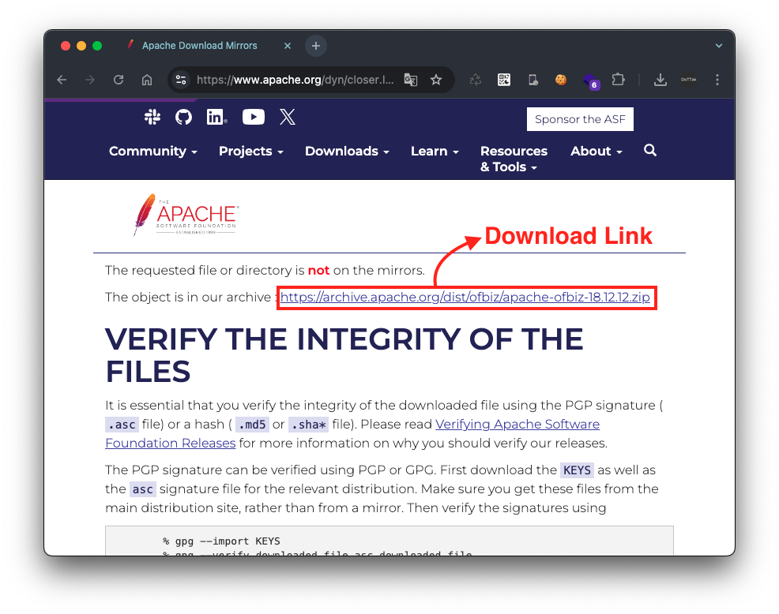
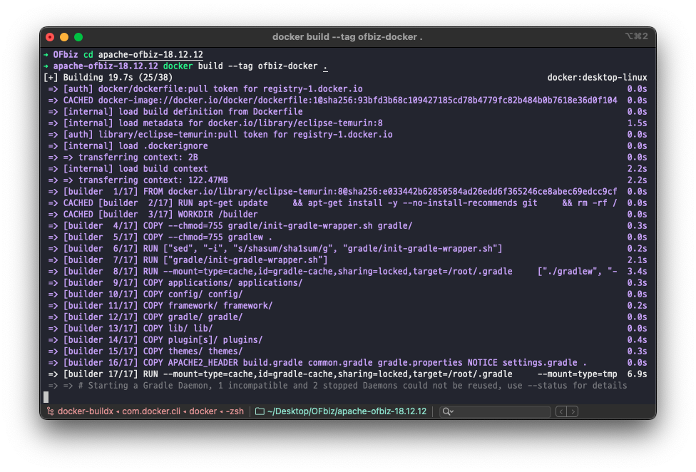
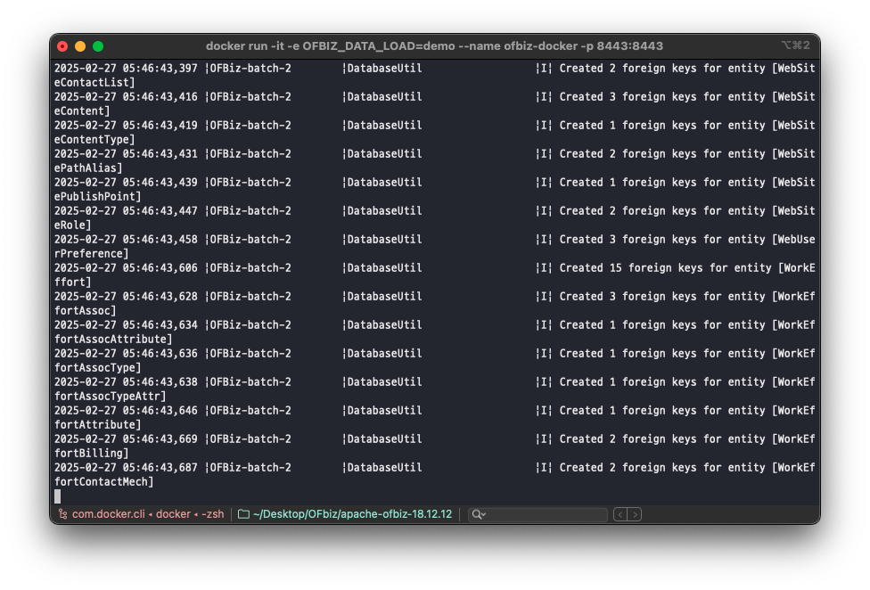
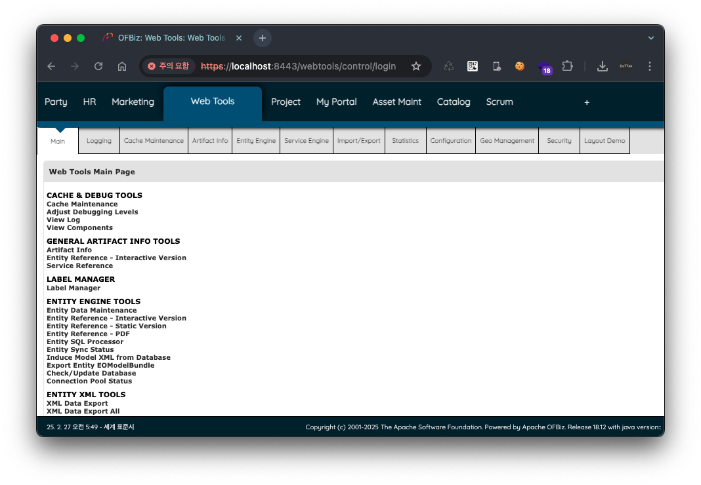
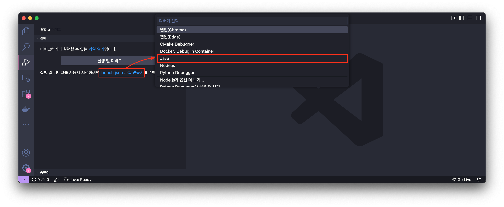
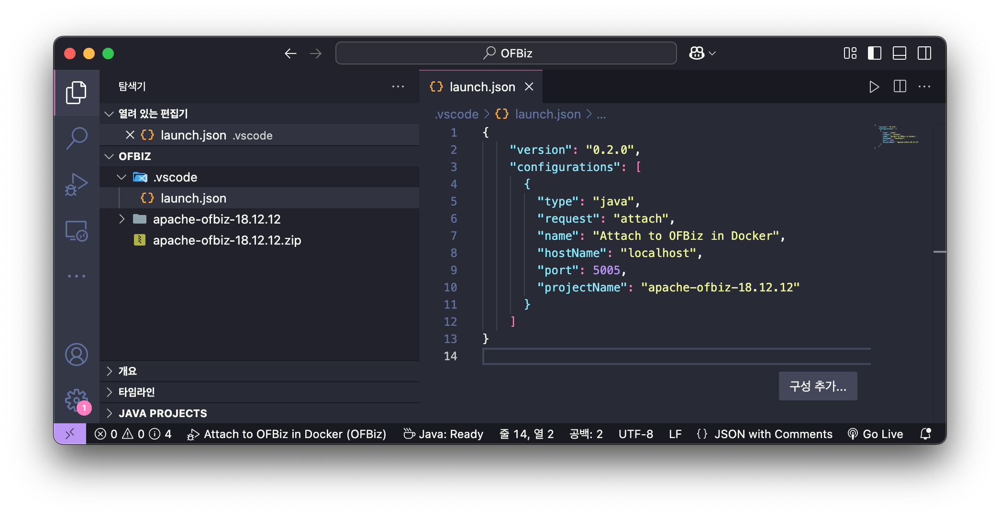
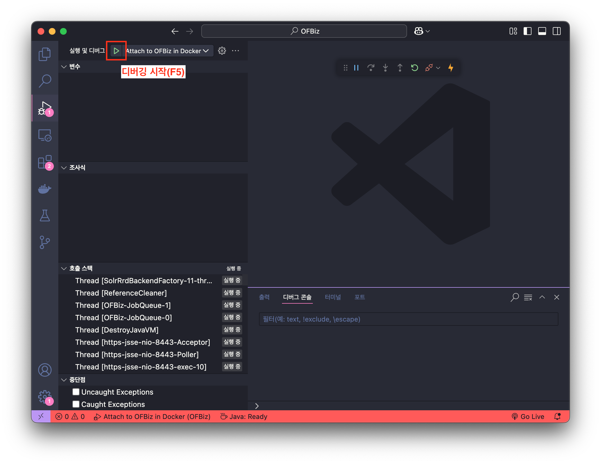
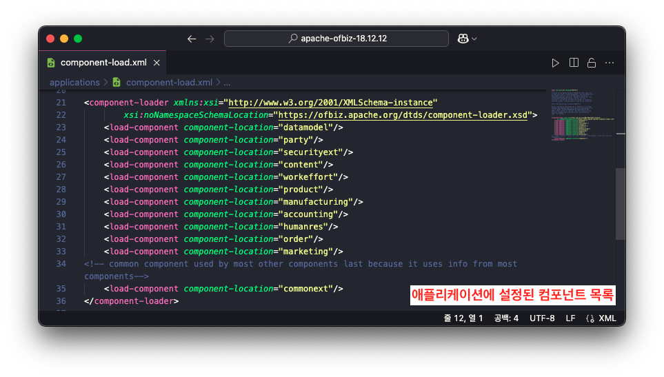
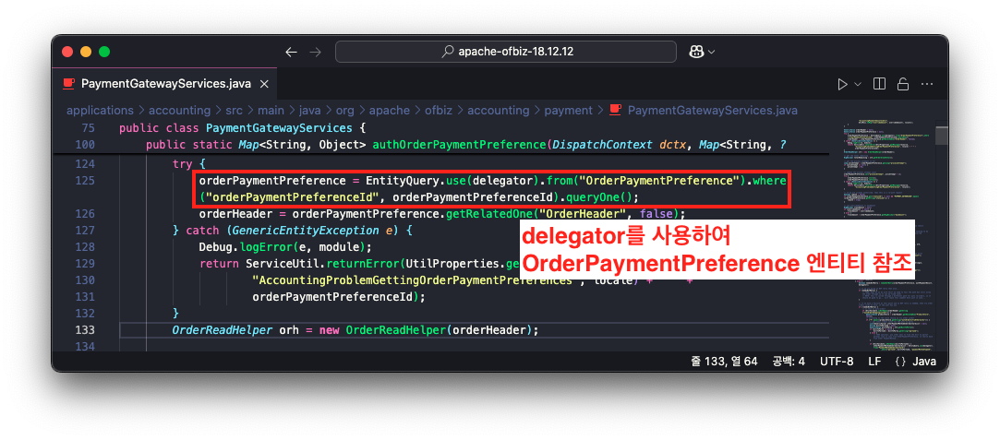
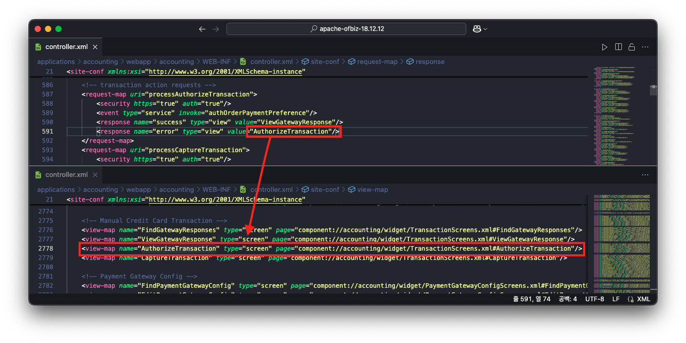

# Apache OFBiz 1-Day 취약점 살펴보기: 개요 (1/7)

> 🔖 **Apache OFBiz 1-Day 취약점 살펴보기**
> 1. [Apache OFBiz 1-Day 취약점 살펴보기: 개요 (1/7)](/Apache%20OFBiz%201-Day%20Analysis/README.md)
> 2. [Apache OFBiz 1-Day 취약점 살펴보기: CVE-2024-32113 (2/7)](/Apache%20OFBiz%201-Day%20Analysis/02.%20Apache%20OFBiz%201-Day%20Analysis%20-%20CVE-2024-32113/README.md)
> 3. [Apache OFBiz 1-Day 취약점 살펴보기: CVE-2024-36104 (3/7)](/Apache%20OFBiz%201-Day%20Analysis/03.%20Apache%20OFBiz%201-Day%20Analysis%20-%20CVE-2024-36104/README.md)
> 4. [Apache OFBiz 1-Day 취약점 살펴보기: CVE-2024-38856 (4/7)](/Apache%20OFBiz%201-Day%20Analysis/04.%20Apache%20OFBiz%201-Day%20Analysis%20-%20CVE-2024-38856/README.md) 
> 5. [Apache OFBiz 1-Day 취약점 살펴보기: CVE-2024-45195 (5/7)](/Apache%20OFBiz%201-Day%20Analysis/05.%20Apache%20OFBiz%201-Day%20Analysis%20-%20CVE-2024-45195/README.md) 
> 6. [Apache OFBiz 1-Day 취약점 살펴보기: CVE-2024-45507 (6/7)](/Apache%20OFBiz%201-Day%20Analysis/06.%20Apache%20OFBiz%201-Day%20Analysis%20-%20CVE-2024-45507/README.md) 
> 7. [Apache OFBiz 1-Day 취약점 살펴보기: CVE-2024-47208 (7/7)](/Apache%20OFBiz%201-Day%20Analysis/07.%20Apache%20OFBiz%201-Day%20Analysis%20-%20CVE-2024-47208/README.md) 

# Introduction

이번 1-Day 취약점 분석 대상은 Apache 재단에서 개발한 OFBiz 프레임워크 입니다.

해당 프레임워크에서 발생한 취약점을 분석하던 중 `CVE-2024-47208` 취약점은 아래 표(Vulnerability Context)로 정리된 이전에 발생한 여러 취약점들과 이어지는 내용이므로 연관성을 확인할 필요가 있습니다. 

따라서, 이번 분석에서는 해당 취약점뿐만 아니라 이전에 발생한 취약점들에 대한 분석과 PoC를 함께 수행하며, 관련 취약점들의 패치가 어떻게 우회되었는지를 살펴보겠습니다.

## Vulnerability Context

| CVE | CWE | CVSS 3.x | Published | Affeted |
| --- | --- | --- | --- | --- |
| CVE-2024-47208 | SSRF, Code Injection | `CRITICAL` 9.8 | 2024년 11월 8일  | <= 18.12.16 |
| CVE-2024-45507 | SSRF, Code Injection | `CRITICAL` 9.8 | 2024년 9월 4일  | <= 18.12.15 |
| CVE-2024-45195 | Forced Browsing | `HIGH` 7.5 | 2024년 9월 4일  | <= 18.12.15 |
| CVE-2024-38856 | Incorrect Authorization | `CRITICAL` 9.8 | 2024년 8월 5일  | <= 18.12.14 |
| CVE-2024-36104 | Path Traversal | `CRITICAL` 9.1 | 2024년 6월 4일  | <= 18.12.13 |
| CVE-2024-32113 | Path Traversal | `CRITICAL` 9.8 | 2024년 5월 8일  | <= 18.12.12 |

먼저, 취약점 분석 이전에 Apache OFBiz 프레임워크에 대해 알아보겠습니다. 참고로 본 보고서에서는 해당 프레임워크에 대한 자세한 설명보다는 취약점 분석에 필요한 사전 지식만을 정리하겠습니다.

# Apache OFBiz 란?

Apache OFBiz는 오픈소스 ERP(Enterprise Resource Planning) 프레임워크로, 기업의 다양한 비즈니스 프로젝트를 통합하여 관리할 수 있도록 설계된 솔루션입니다.

해당 프레임워크는 기업의 다양한 비즈니스 프로세스를 통합하여 관리할 수 있도록 설계 되었으며, ERP 기능 뿐만 아니라 CRM(Customer Relationship Management), 전자상거래, 회계, 제조, 프로젝트 관리 등의 기능을 제공합니다.

## 주요 기능 및 특징

Apache OFBiz는 다음과 같은 핵심 기능을 제공합니다.

✅ 비즈니스 프로세스 통합

- 주문, 재고, 회계, 제조, 고객 관리 등 기업 운영에 필요한 다양한 기능을 통합 관리할 수 있습니다.

✅ 모듈식 아키텍처

- 각 기능이 독립적인 모듈로 제공되어 필요에 따라 선택적으로 적용하거나 커스터마이징이 가능합니다.

✅ Java 기반 프렘임워크

- Java 및 Groovy 언어를 기반으로 개발되었으며, Apache Tomcat, PostgreSQL, MySQL 등과 연동하여 사용이 가능합니다.

✅ 플러그인 확장 기능

- 기업의 특정 요구사항에 맞춰 새로운 기능을 추가할 수 있는 확장성과 유연성을 제공합니다.

✅ 오픈소스 및 커뮤니티 지원

- Apache 라이선스(ASF 2.0) 기반의 오픈소스로, 비용 없이 사용할 수 있으며, 글로벌 커뮤니티에서 지속적으로 업데이트 및 유지보수를 진행하고 있습니다.

## 사용 사례

Apache OFBiz는 다양한 산업군에서 활용되고 있으며, 다음과 같은 비즈니스 환경에서 많이 사용됩니다.

📌 **전자상거래**

- B2B 및 B2C 전자상거래 플랫폼 구축
- 상품 카탈로그, 주문 처리, 결제 시스템 운영

📌 **재고 및 물류 관리**

- 창고 및 인벤토리 관리 시스템(WMS) 구축
- 물류 프로세스 최적화 및 자동화

📌 **회계 및 재무 관리**

- 기업의 회계 처리 및 세금 관리 시스템
- 송장 및 결제 시스템 연동

📌 **제조업 및 프로젝트 관리**

- 생산 및 조립 프로세스 관리
- 프로젝트 및 작업 흐름(WFM) 관리

# Apache OFBiz 설치 및 실행

다음은 Apache OFBiz 프레임워크를 설치하고 실행하는 방법에 대해 설명드리겠습니다. 일반적으로는 직접 프로젝트를 내려받아 환경을 구축하고 실행하지만, 본 보고서는 취약점 분석이 주 내용이기에 Docker를 활용하여 쉽고 빠르게 환경을 구성하는 방법으로 설명드리겠습니다.

## 설치

Apache OFBiz 프레임워크 프로젝트는 아래 사이트에서 내려받을 수 있습니다. 이때, 각각의 버전은 다운로드 URL 상 버전에 해당하는 부분을 변경하면 됩니다.

> 이번 분석에 필요한 버전은 18.12.12, 18.12.13, 18.12.14, 18.12.15, 18.12.16 입니다.
> 

```
https://www.apache.org/dyn/closer.lua/ofbiz/apache-ofbiz-<버전>.zip
```

예를 들어, 아래의 URL은 Apache OFBiz 버전 18.12.12를 내려받는 URL입니다.

[Apache Download Mirrors - v18.12.12](https://www.apache.org/dyn/closer.lua/ofbiz/apache-ofbiz-18.12.12.zip)

해당 사이트에 접속한 뒤, 화면에 나와있는 설치 링크를 클릭하여 압축된 프로젝트를 다운로드를 받고 압축을 해제하면 설치는 끝이납니다.



## 실행

압축 파일인 Apache OFBiz 프레임워크 프로젝트를 다운로드 받고 압축을 해제 했으면 다음과 같이 프로젝트 폴더가 생성됩니다. 


터미널에서 해당 폴더로 이동한 후, 아래의 명령어를 입력하여 Apache OFBiz 도커 이미지를 빌드합니다.

```bash
docker build --tag ofbiz-docker .
```



이미지 빌드가 완료됐으면 Apache OFBiz 도커 이미지(`ofbiz-docker`)를 컨테이너로 실행합니다. 참고로, 처음 실행할 때는 기본 데이터 로드 및 초기화 작업을 위해 시간이 다소 소요됩니다.

```bash
docker run -it -e OFBIZ_DATA_LOAD=demo --name ofbiz-docker -p 8443:8443 ofbiz-docker
```

> `OFBIZ_DATA_LOAD` 환경 변수는 초기 데이터 로드 옵션으로, 다음과 같습니다.
> 
> - `OFBIZ_DATA_LOAD=demo` → 데모 데이터 로드 (제품, 고객, 주문, 계정 등 샘플 데이터 포함)
> - `OFBIZ_DATA_LOAD=seed` → 기본 시드 데이터만 로드 (필수 시스템 데이터만 있음)
> - `OFBIZ_DATA_LOAD=none` → 데이터 로드 안 함



Apache OFBiz 컨테이너가 정상적으로 실행되면 웹 브라우저에서 다음 URL로 접속할 수 있습니다. 이후 초기 로그인 시 기본 관리자 계정(admin/ofbiz)으로 로그인하면 아래의 화면이 나타납니다.

> Apache OFBiz는 기본적으로 `https` 프로토콜을 사용하여 보안 연결을 제공합니다.
> 

```
https://localhost:8443/webtools
```



## 디버깅

Apache OFBiz를 Docker로 실행할 때, VS Code에서 원격으로 디버깅하는 방법에 대한 설명입니다.

### JPDA 활성화

JPDA(Java Platform Debugger Architecture)는 Java 애플리케이션을 디버깅하기 위한 표준 아키텍처입니다. 이를 활성화하기 위해서는 환경변수 `JAVA_TOOL_OPTIONS` 에 아래의 값을 입력하면 됩니다.

```
-agentlib:jdwp=transport=dt_socket,server=y,suspend=n,address=0.0.0.0:5005
```

✅ 옵션 설명

- `-agentlib:jdwp` 원격 디버깅 모드
- `transport=dt_socket` TCP/IP 소켓 통신 사용
- `server=y` 서버 모드 활성화
- `suspend=n` 디버거 연결 없이 애플리케이션 시작
- `address=0.0.0.0:5005` 0.0.0.0:5005 주소로 디버그 연결 설정

즉, 도커로 OFbiz 프레임워크를 실행할 때, 아래와 같이 환경 변수를 지정하여 실행하면 됩니다.

```bash
docker run -it -e OFBIZ_DATA_LOAD=demo -e JAVA_TOOL_OPTIONS="-agentlib:jdwp=transport=dt_socket,server=y,suspend=n,address=0.0.0.0:5005" --name ofbiz-docker -p 5005:5005 -p 8443:8443 ofbiz-docker
```

### VS Code 설정

VS Code의 디버그 탭(`cmd + shift + d`)에서 ‘launch.json 파일 만들기’를 클릭하여 Java 디버거를 선택합니다.

> 참고로 Java 관련 VS Code의 Extension(`Extension Pack for Java)`을 설치해야합니다.
> 



이후 생성된 `launch.json` 파일에 아래의 코드로 변경합니다.

> `projectName` 에 `<버전>`에는 현재 실행중인 OFBiz의 버전을 입력합니다.
> 

```json
{
    "version": "0.2.0",
    "configurations": [
      {
        "type": "java",
        "request": "attach",
        "name": "Attach to OFBiz in Docker",
        "hostName": "localhost",
        "port": 5005,
                "projectName": "apache-ofbiz-<버전>"
      }
    ]
}
```



그 다음 다시 디버그 탭으로 이동한 다음 디버깅 시작(`F5`) 버튼을 누르면 디버깅이 시작됩니다.



# 프로젝트 구조

내려받은 Apache OFBiz(v18.12.12) 프로젝트 구조를 살펴보겠습니다. 

## 주요 디렉터리

주로 살펴볼 디렉터리는 `applications`, `framework` 디렉터리입니다.

📁 applications/

- 각 도메인별 애플리케이션이 모여 있는 디렉터리(e.g. `accounting` 회계 모듈, `order` 주문 관리 모듈)

📁 framework/

- OFBiz의 핵심 프레임워크 기능이 모여 있는 디렉터리(e.g. `webapp` 웹 애플리케이션 공통 기능, `webtools` 개발 및 관리 툴)

```bash
➜ apache-ofbiz-18.12.12 tree -L 1
.
├── applications/           # 도메인별 애플리케이션 (모듈별 기능)
│   ├── accounting/         # 회계 모듈
│   ├── order/              # 주문 관리 모듈
│   ├── product/            # 상품 관리 모듈
│   ├── humanres/           # 인사 관리 모듈
│   ├── manufacturing/      # 제조 모듈
│   ├── marketing/          # 마케팅 모듈
│   ├── party/              # 사용자 및 조직 관리
│   ├── workeffort/         # 작업 관리 모듈
│   ├── commonext/          # 공통 확장 기능
│   └── component-load.xml  # 컴포넌트 정의 파일 ⭐️
│
└── framework/              # OFBiz 프레임워크 핵심 기능
│   ├── base/               # 기본 프레임워크 기능
│   ├── entity/             # 데이터 엔진 (Entity Engine)
│   ├── service/            # 서비스 엔진 (비즈니스 로직)
│   ├── security/           # 보안 관련 기능
│   ├── webapp/             # 웹 애플리케이션 공통 기능
│   ├── webtools/           # 개발 및 관리 툴 (Webtools)
│   └── widget/             # UI 위젯 및 화면 구성 요소
│   └── component-load.xml  # 컴포넌트 정의 파일 ⭐️
... # 생략
```

## 컴포넌트

`applications`, `framework` 디렉터리 하위에 있는 디렉터리들을 컴포넌트(Component)라 부르며, OFBiz의 모든 애플리케이션은 컴포넌트입니다. 

이 컴포넌트는 독립적인 기능을 제공하는 모듈을 의미하며, `component-load.xml` 파일에서 각 컴포넌트의 메타데이터를 설정하여 시스템이 해당 컴포넌트를 로드하는데 사용됩니다.



# MVC 구조

Apache OFBiz 프레임워크는 MVC(Model-View-Controller) 아키텍처를 기반으로 동작합니다. 즉, URL로 요청이 들어오면 이를 처리하는 과정에서 Controller → Model → View 순으로 동작합니다.

## Controller - 요청 처리 및 흐름 제어

사용자가 웹 애플리케이션에 특정 URL로 요청을 보내면, 가장 먼저 Controller가 이를 처리합니다. OFBiz에서는 `controller.xml` 파일이 컨트롤러 역할을 하며, 각 URL 요청에 대해 실행할 이벤트와 이후 렌더링할 뷰(View)를 정의합니다.

🔍 applications/accounting/webapp/accounting/WEB-INF/controller.xml 파일 일부

```xml
<request-map uri="processAuthorizeTransaction">
    <security https="true" auth="true"/>
    <event type="service" invoke="authOrderPaymentPreference"/>
    <response name="success" type="view" value="ViewGatewayResponse"/>
    <response name="error" type="view" value="AuthorizeTransaction"/>
</request-map>
```

위 코드에서 `processAuthorizeTransaction` URL로 요청이 들어오면 `authOrderPaymentPreference` 서비스를 실행하고, 성공 시 `ViewGatewayResponse` 뷰를, 실패 시 `AuthorizeTransaction` 뷰를 렌더링합니다.

✅ `controller.xml` 에서 이벤트를 정의할 때 `<event>` 요소의 `type` 속성 값

| 속성 값 | 실행 방식 | 사용 목적 | 특징 |
| --- | --- | --- | --- |
| `service` | 서비스 엔진을 통해 실행 | 데이터베이스 조작, 비즈니스 로직 | 실행할 서비스는 `servicers.xml` 또는 `services_xxx.xml` 에 정의 |
| `java`  | Java 클래스의 특정 메서드 직접 실행 | HTTP 요청 처리, 복잡할 로직 실행 | `HttpServletRequest`/`HttpServletResponse` 사용 가능 |

## Model - 비즈니스 로직 및 데이터 처리

컨트롤러에서 특정 이벤트(서비스)를 실행하면, Model 계층에서 비즈니스 로직을 수행하고 서비스(Service) 및 엔티티(Entity)를 활용하여 데이터를 처리합니다.

### 서비스(Service)

컨트롤러에서 실행한 서비스는 비즈니스 로직을 처리하는 핵심 요소로, 서비스는 `services.xml` 또는 `services_xxx.xml` 파일에 정의합니다.

🔍 applications/accounting/servicedef/services_paymentmethod.xml 파일 일부

```xml
<service name="authOrderPaymentPreference" engine="java"
        location="org.apache.ofbiz.accounting.payment.PaymentGatewayServices" invoke="authOrderPaymentPreference" auth="true">
    <description>Process (authorizes/re-authorizes) a single payment for an order with an optional overrideAmount</description>
    <attribute name="orderPaymentPreferenceId" type="String" mode="IN" optional="false"/>
    <attribute name="overrideAmount" type="BigDecimal" mode="IN" optional="true"/>
    <attribute name="finished" type="Boolean" mode="OUT" optional="false"/>
    <attribute name="errors" type="Boolean" mode="OUT" optional="false"/>
    <attribute name="messages" type="List" mode="OUT" optional="true"/>
    <attribute name="processAmount" type="BigDecimal" mode="OUT" optional="true"/>
    <attribute name="authCode" type="String" mode="OUT" optional="true"/>
</service>
```

위 서비스 정의를 살펴보면 `org.apache.ofbiz.accounting.payment.PaymentGatewayServices` 클래스에서 `authOrderPaymentPreference` 메서드를 호출하는 것을 확인할 수 있습니다.

✅ `<attribute>` 요소의 `mode` 속성

- IN: 서비스 실행 시 입력되는 파라미터 값
- OUT: 서비스 실행 후 반환되는 결과 값

### 엔티티(Entity)

엔티티는 OFBiz에서 데이터베이스 테이블과 상호작용하는 객체로, XML 파일에서 정의됩니다. 각 엔티티는 데이터베이스 테이블을 표현하며, 필드는 테이블의 열을 나타냅니다.

🔍 framework/entity/entitydef/entitymodel.xml 파일 일부

```xml
<entity entity-name="OrderPaymentPreference"
            package-name="org.apache.ofbiz.order.order"
            never-cache="true"
            title="The Order Payment Preference">
      <field name="orderPaymentPreferenceId" type="id"></field>
      <field name="orderId" type="id"></field>
      <field name="orderItemSeqId" type="id"></field>
          ... 생략
</entity>
```

엔티티는 `delegator` 를 사용하여 데이터를 조작합니다. 따라서, `OrderPaymentPreference` 엔티티는 다음과 같이 `authOrderPaymentPreference` 서비스 호출 시 호출되는 `PaymentGatewayServices` 클래스의 `authOrderPaymentPreference` 메서드 내에서 `delegator` 를 사용하여 데이터를 조회하는 것을 확인하실 수 있습니다.



## View - 사용자 화면 출력

비즈니스 로직을 수행한 결과를 사용자에게 보여주기 위해 View 계층에서 화면을 렌더링합니다. OFBiz에서는 `Screen Widget` 또는 `FreeMarker(FTL)` 템플릿을 활용하여 UI를 구성합니다.

이때, 뷰 정의 부분은 `controller.xml` 내 `<view-map>` 요소에서 확인할 수 있습니다. 예를 들어, 앞서 살펴본 `processAuthorizeTransaction` URL 요청에 대한 실패 응답은 `AuthorizeTransaction` 뷰로 정의되어 있습니다.



🔍 applications/accounting/webapp/accounting/WEB-INF/controller.xml 파일 일부

```xml
<view-map name="AuthorizeTransaction" type="screen" page="component://accounting/widget/TransactionScreens.xml#AuthorizeTransaction"/>
```

위 `AuthorizeTransaction` 뷰에서는 `screen` 타입 즉, `Screen Widget` 으로 화면을 렌더링합니다.

✅ `<view-map>` 요소의 `type` 속성

| 타입 (`type` 값) | 설명 |
| --- | --- |
| `ftl` | FreeMarker 템플릿 (`.ftl` 파일) |
| `screen` | OFBiz 스크린 위젯 (XML 기반 UI) |
| `json` | JSON 데이터 응답 |
| `xml` | XML 데이터 응답 |
| `redirect` | 특정 URL로 리디렉션 |

## MVC 흐름 요약

즉, Apache OFBiz의 MVC(Model-View-Controller) 아키텍처는 사용자 요청을 처리하고 화면에 데이터를 렌더링하는 구조로, 전체적인 흐름은 다음과 같습니다.

1. 사용자가 웹 애플리케이션에 URL 요청
2. Controller(`controller.xml`)가 요청을 처리
    - 요청이 컨트롤러로 전달되며, 해당 URL에 대한 매핑을 확인합니다.
    - 컨트롤러는 요청을 특정 서비스 또는 Java 이벤트로 연결하고, 처리 결과에 따라 적절한 뷰(View)로 응답을 설정합니다.
3. Model 계층에서 비즈니스 로직 수행
    - 컨트롤러에서 호출된 서비스가 실행되면서 데이터베이스와 상호작용합니다.
    - `Service Engine`을 통해 서비스가 실행되며, `Delegator`를 이용해 엔티티(Entity)에서 데이터를 조회하고 조작합니다.
    - 서비스 실행 결과에 따라 성공 또는 실패 여부가 결정됩니다.
4. Controller가 결과를 받아 View로 전달
    - 서비스 실행 결과에 따라 뷰(View)를 선택하여 사용자에게 응답합니다.
5. View(`Screen Widget` 또는 `FreeMarker`)에서 최종 화면 출력
    - 컨트롤러에서 지정한 뷰를 렌더링하여 사용자에게 결과를 출력합니다.

✅ 아래는 앞서 살펴본 `/processAuthorizeTransaction` 요청에 대한 흐름입니다.

```
사용자 요청 (URL: /processAuthorizeTransaction)
       │
       ▼
Controller (controller.xml)
       │
       ▼
Model (서비스 실행)
       ├── Service Engine 실행 (services_paymentmethod.xml)
       ├── Java 클래스 메서드 실행 (PaymentGatewayServices.java)
       ├── 데이터 조회 및 처리 (Delegator, Entity Engine)
       ▼
Controller가 응답 처리 (success 또는 error)
       │
       ▼
View (Screen Widget 또는 FreeMarker)
       │
       ▼
사용자 화면 출력
```

# Continue…

그럼 이제 첫 번째 취약점인 [Apache OFBiz 1-Day 취약점 살펴보기: CVE-2024-32113 (2/7)](/Apache%20OFBiz%201-Day%20Analysis/02.%20Apache%20OFBiz%201-Day%20Analysis%20-%20CVE-2024-32113/README.md) 에 대해 알아보겠습니다.

> 🔖 **Apache OFBiz 1-Day 취약점 살펴보기**
> 1. [Apache OFBiz 1-Day 취약점 살펴보기: 개요 (1/7)](/Apache%20OFBiz%201-Day%20Analysis/README.md)
> 2. [Apache OFBiz 1-Day 취약점 살펴보기: CVE-2024-32113 (2/7)](/Apache%20OFBiz%201-Day%20Analysis/02.%20Apache%20OFBiz%201-Day%20Analysis%20-%20CVE-2024-32113/README.md)
> 3. [Apache OFBiz 1-Day 취약점 살펴보기: CVE-2024-36104 (3/7)](/Apache%20OFBiz%201-Day%20Analysis/03.%20Apache%20OFBiz%201-Day%20Analysis%20-%20CVE-2024-36104/README.md)
> 4. [Apache OFBiz 1-Day 취약점 살펴보기: CVE-2024-38856 (4/7)](/Apache%20OFBiz%201-Day%20Analysis/04.%20Apache%20OFBiz%201-Day%20Analysis%20-%20CVE-2024-38856/README.md) 
> 5. [Apache OFBiz 1-Day 취약점 살펴보기: CVE-2024-45195 (5/7)](/Apache%20OFBiz%201-Day%20Analysis/05.%20Apache%20OFBiz%201-Day%20Analysis%20-%20CVE-2024-45195/README.md) 
> 6. [Apache OFBiz 1-Day 취약점 살펴보기: CVE-2024-45507 (6/7)](/Apache%20OFBiz%201-Day%20Analysis/06.%20Apache%20OFBiz%201-Day%20Analysis%20-%20CVE-2024-45507/README.md) 
> 7. [Apache OFBiz 1-Day 취약점 살펴보기: CVE-2024-47208 (7/7)](/Apache%20OFBiz%201-Day%20Analysis/07.%20Apache%20OFBiz%201-Day%20Analysis%20-%20CVE-2024-47208/README.md) 

---

# References

- https://ofbiz.apache.org/security.html
- https://en.wikipedia.org/wiki/Apache_OFBiz
- https://ofbizextra.org/ofbiz_adocs/docs/asciidoc/developer-manual.html
- https://medium.com/@klymok.nazariy/how-to-remotely-debug-spring-boot-application-in-docker-compose-in-intellij-e9e4422dafce